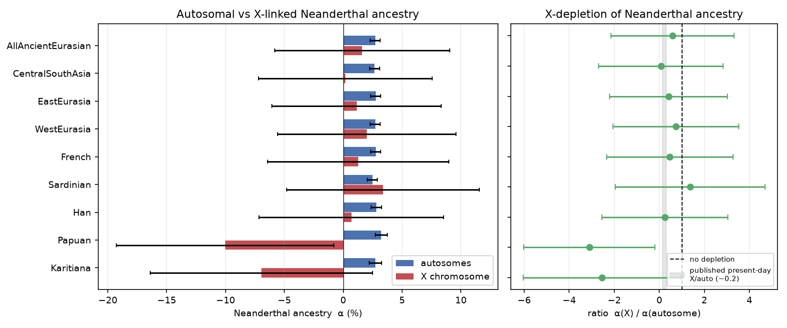

# X-chromosome depletion of Neanderthal ancestry

*Panel: ho — 579,720 autosomal SNPs, 3,814 X SNPs (~1.7k usable, capped by Vindija's X coverage).*

## Result

Pooling all 15,443 retained ancient Eurasian genomes, the autosomal Neanderthal estimate is **2.72%** (as expected) while the X reads **1.60%** — ratio **α(X)/α(auto) = 0.5896 ± 2.7352** (depletion Z = 0.15). **This is inconclusive: the AADR X panel is too sparse to resolve the depletion.** Only ~1.7k X SNPs carry the outgroup, so α(X) has a very large jackknife SE and the X/auto ratio is not significantly below 1 (and swings wildly, even negative, for small cohorts). The expected ~5x X-depletion cannot be demonstrated from AADR at this SNP density; it would need shotgun genomes or a denser panel with outgroup X coverage.

## Per-cohort

| cohort             | kind           |   n_ind |   α_auto (%) |   α_X (%) |   ratio |   ratio_SE |   depletion_Z |
|:-------------------|:---------------|--------:|-------------:|----------:|--------:|-----------:|--------------:|
| AllAncientEurasian | ancient_pooled |   15443 |         2.72 |      1.6  |  0.5896 |     2.7352 |          0.15 |
| CentralSouthAsia   | ancient_region |    2687 |         2.67 |      0.19 |  0.0702 |     2.7644 |          0.34 |
| EastEurasia        | ancient_region |    1808 |         2.76 |      1.14 |  0.414  |     2.614  |          0.22 |
| WestEurasia        | ancient_region |   10897 |         2.72 |      2    |  0.7346 |     2.7865 |          0.1  |
| French             | present_day    |      91 |         2.75 |      1.29 |  0.4671 |     2.7985 |          0.19 |
| Sardinian          | present_day    |      58 |         2.47 |      3.4  |  1.3765 |     3.325  |         -0.11 |
| Han                | present_day    |     153 |         2.81 |      0.69 |  0.2443 |     2.7951 |          0.27 |
| Papuan             | present_day    |      46 |         3.23 |    -10.04 | -3.1099 |     2.9016 |          1.43 |
| Karitiana          | present_day    |      28 |         2.72 |     -6.95 | -2.5528 |     3.5008 |          1.02 |

## Method

The AADR `.snp` codes the X as `23`. We run the pipeline's pooled f4-ratio α = f4(Altai, Chimp; POOL, Mbuti) / f4(Altai, Chimp; Vindija, Mbuti) separately on autosomes (1–22) and X (23), with a 50-block delete-one jackknife. The two SNP sets are disjoint, so α(X) and α(auto) are independent; the depletion Z uses summed jackknife variances and the ratio SE the delta method. Cohorts are pooled because a single pseudo-haploid ancient covers too few X SNPs to estimate α.

## Why the Human Origins panel

The f4-ratio needs the Chimp outgroup *on the X*. In AADR 1240K the outgroup sequences (Chimp.REF, Gorilla.REF, Ancestor.REF) have **zero X genotypes**, so the statistic is undefined on the X there. The Human Origins panel carries Chimp across the X (all 3,814 HO X SNPs), which is why this analysis uses it; the QC'd ancient cohort is inherited from the 1240K Phase-2 metadata by genetic_id.

## Interpretation & caveats

- The biology is well established — Neanderthal ancestry is ~5x lower on the X (faster-X / reduced male hybrid fertility; Sankararaman et al. 2014; Vernot & Akey 2014) — but this analysis **cannot resolve it on AADR**, so nothing here should be read as confirming or refuting it.

- The limitation is SNP count, not sample size: the HO X panel has only ~3.8k SNPs and the Vindija scale rests on ~1.7k, so α(X)'s jackknife SE is ~17x the autosomal one and floored by the number of X SNP-blocks — pooling more genomes does not help. Per-cohort X/auto ratios (e.g. Han 0.24, Papuan −3.1) are individually meaningless at this SE and should not be interpreted.

- The X/auto *ratio* is the right (offset-free) quantity to compare, and the autosomal arm reproduces the expected ~2–3% perfectly; only the X arm is data-starved. A real test would need shotgun diploid genomes or a denser panel that genotypes an outgroup across the X.

*Refs: Sankararaman et al. 2014 Nature 507:354; Vernot & Akey 2014 Science 343:1017; Petr et al. 2019 PNAS 116:1639; Mallick et al. 2024 Sci. Data 11:182 (AADR).*
