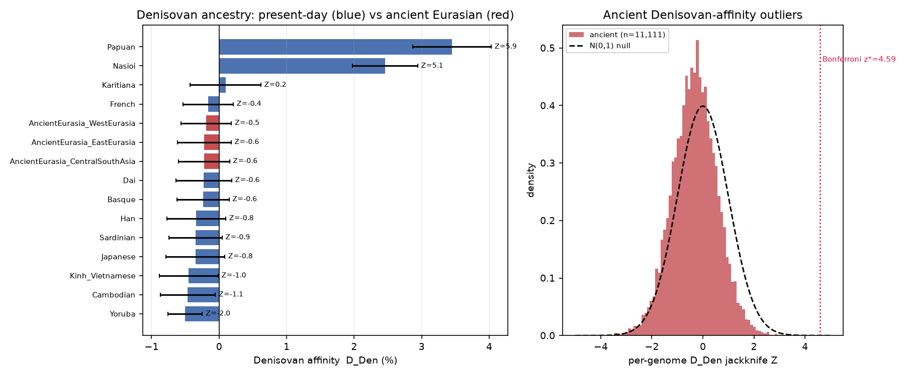

# Denisovan-ancestry survey (with positive control)

*Panel 1240k. Present-day pops are the positive control; ancient Eurasians are surveyed from Phase 3 (D_Den SNP floor 150,000).*

## Headline

The D_Den statistic is **well-powered**: it recovers the known Denisovan ancestry of Oceanians (Papuan D_Den = 3.45% (Z=5.92)), grading down through East Asians to ~0 in West Eurasians and Africans. Against that calibrated scale, **ancient Eurasians carry no detectable Denisovan ancestry** — every regional bin sits at ~0, there is no west->east gradient (corr(D_Den, lon) = -0.019), and **0** of 11,111 genomes exceed the Bonferroni outlier threshold (z* = 4.59). This is a *controlled* null: the positive control proves it is a real absence, not lack of power.

## Present-day positive control

| group           | tier               |   n_ind |   D_Den (%) |     Z |   nSNP |
|:----------------|:-------------------|--------:|------------:|------:|-------:|
| Papuan          | Oceanian (high)    |      32 |        3.45 |  5.92 | 560995 |
| Nasioi          | Oceanian (high)    |      13 |        2.46 |  5.09 | 560979 |
| Karitiana       | American           |      16 |        0.1  |  0.18 | 560997 |
| French          | West Eurasian (~0) |      31 |       -0.16 | -0.44 | 560995 |
| Dai             | East/SE Asian      |      14 |       -0.23 | -0.55 | 560997 |
| Basque          | West Eurasian (~0) |      25 |       -0.24 | -0.62 | 560989 |
| Han             | East/SE Asian      |      46 |       -0.34 | -0.77 | 560996 |
| Sardinian       | West Eurasian (~0) |      31 |       -0.35 | -0.89 | 560995 |
| Japanese        | East/SE Asian      |      31 |       -0.35 | -0.81 | 560996 |
| Kinh_Vietnamese | East/SE Asian      |      10 |       -0.45 | -1.03 | 560974 |
| Cambodian       | East/SE Asian      |      11 |       -0.46 | -1.14 | 560976 |
| Yoruba          | African (0)        |      24 |       -0.5  | -1.97 | 560995 |

## Ancient Eurasian survey

| group                           |   n_ind |   D_Den (%) |     Z |   nSNP |
|:--------------------------------|--------:|------------:|------:|-------:|
| AncientEurasia_WestEurasia      |   10897 |       -0.19 | -0.51 | 560997 |
| AncientEurasia_CentralSouthAsia |    2687 |       -0.22 | -0.59 | 560997 |
| AncientEurasia_EastEurasia      |    1808 |       -0.22 | -0.55 | 560997 |

## EPAS1 (Denisovan hypoxia locus)

0 Denisovan-specific SNPs in the EPAS1 window; mean Denisovan-allele frequency: n/a. The Denisovan EPAS1 adaptive haplotype is essentially Tibetan-specific (Huerta-Sanchez et al. 2014), and AADR has no Tibetan ancients, so a flat/low signal here is the expected result, not evidence against the locus.

## Interpretation & caveats

- The ancient null is expected and informative: AADR's ancient Eurasian sampling does **not** include the high-Denisovan populations (Oceanians, Island SE Asians, Philippine Negritos), and East Asian Denisovan ancestry (~0.2%) is below what D_Den resolves per regional pool. The present-day control makes this explicit rather than leaving it ambiguous.

- D_Den is a *relative* affinity (one high-coverage Denisovan; the absolute scale is not calibrated to a percentage) — only the ordering and significance are interpreted. Any future outlier would be a hypothesis for higher-coverage follow-up, consistent with the pipeline's ethos.

*Refs: Reich et al. 2011 AJHG 89:516; Meyer et al. 2012 Science 338:222; Huerta-Sanchez et al. 2014 Nature 512:194; Mallick et al. 2024 Sci. Data 11:182 (AADR).*
