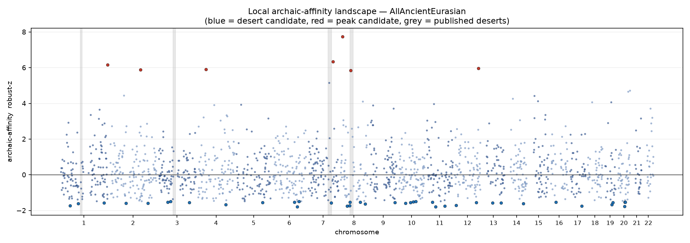

# Genome-wide local archaic-affinity scan

*Panel 1240k · cohort AllAncientEurasian (15,443 pooled genomes) · 34,723 archaic-informative SNPs · 1000 kb windows.*

## Validation against published deserts

Windows inside published Neanderthal deserts have median z = -0.10 (n=21) vs 0.01 for the rest of the genome; Mann-Whitney one-sided p = 4.25e-01. The published deserts are **not** significantly depleted in this scan (see caveat): windowed archaic-allele frequency on ascertained SNPs is dominated by shared ancestral variation, which is not desert-structured, so the low tail here does not reliably map introgression deserts. The **peak** direction, by contrast, does recover known adaptive-introgression loci (below).

## Where known adaptive-introgression loci fall

Percentile is the window's rank among all windows (0 = lowest affinity / deepest desert, 100 = highest / strongest peak).

| gene        |   chrom | pheno                        |     z |   pctile | tail   |
|:------------|--------:|:-----------------------------|------:|---------:|:-------|
| BNC2        |       9 | skin pigmentation            |  3.89 |     98.7 | peak   |
| OAS1-3      |      12 | antiviral innate immunity    |  0.92 |     77.7 | peak   |
| TLR1-6-10   |       4 | innate immunity (TLRs)       |  1.2  |     83.4 | peak   |
| STAT2       |      12 | interferon immunity          | -0.3  |     36.5 | desert |
| SLC16A11    |      17 | lipid metabolism / T2D       | -0.23 |     39.9 | desert |
| POU2F3      |      11 | keratinocyte differentiation | -0.48 |     30.1 | desert |
| TBX15-WARS2 |       1 | body-fat / cold response     |  0.17 |     56.2 | peak   |
| FADS1-2     |      11 | fatty-acid metabolism        |  2.07 |     92.8 | peak   |
| KRT-cluster |      12 | keratin / skin & hair        |  1.83 |     91.6 | peak   |
| OCA2-HERC2  |      15 | eye/skin pigmentation        |  4.42 |     99.2 | peak   |
| HLA         |       6 | MHC / adaptive immunity      |  1.78 |     91   | peak   |
| EPAS1       |       2 | hypoxia (Denisovan; control) |  0.92 |     78   | peak   |
| IL18RAP     |       2 | inflammatory immunity        | -0.11 |     44.8 | desert |

## Strongest desert candidates (low archaic affinity)

|   chrom |     start |       end |   n_snp |       mean |        z |      emp_p |
|--------:|----------:|----------:|--------:|-----------:|---------:|-----------:|
|       6 | 126000000 | 127000000 |      10 | 0.00100472 | -1.79307 | 0.00127959 |
|      11 |  46000000 |  47000000 |      12 | 0.00157887 | -1.78256 | 0.00255918 |
|      20 |  33000000 |  34000000 |      14 | 0.00185563 | -1.7775  | 0.00383877 |
|      17 |  62000000 |  63000000 |      25 | 0.00340409 | -1.74916 | 0.00511836 |
|      11 |  93000000 |  94000000 |      16 | 0.0034906  | -1.74757 | 0.00639795 |
|       8 |  35000000 |  36000000 |      10 | 0.00352675 | -1.74691 | 0.00767754 |
|       1 |  50000000 |  51000000 |      10 | 0.00403801 | -1.73755 | 0.00895713 |
|       8 |  48000000 |  49000000 |      19 | 0.00480555 | -1.7235  | 0.0102367  |
|      12 |   6000000 |   7000000 |      11 | 0.00609474 | -1.69991 | 0.0115163  |
|       4 | 145000000 | 146000000 |      12 | 0.00750888 | -1.67402 | 0.0127959  |
|      19 |  37000000 |  38000000 |      21 | 0.00772901 | -1.66999 | 0.0140755  |
|       8 | 129000000 | 130000000 |      16 | 0.00966328 | -1.63459 | 0.0153551  |
|      14 |  87000000 |  88000000 |      13 | 0.0109665  | -1.61074 | 0.0166347  |
|       1 |  94000000 |  95000000 |      11 | 0.0113324  | -1.60404 | 0.0179143  |
|       2 |  84000000 |  85000000 |      14 | 0.0123234  | -1.5859  | 0.0191939  |

## Strongest peak candidates (high archaic affinity)

|   chrom |     start |       end |   n_snp |     mean |       z |      emp_p |
|--------:|----------:|----------:|--------:|---------:|--------:|-----------:|
|       8 |  11000000 |  12000000 |      11 | 0.522132 | 7.74553 | 0.00127959 |
|       7 | 131000000 | 132000000 |      11 | 0.444842 | 6.33083 | 0.00255918 |
|       1 | 247000000 | 248000000 |      12 | 0.436019 | 6.16934 | 0.00383877 |
|      12 | 123000000 | 124000000 |      17 | 0.424533 | 5.95911 | 0.00511836 |
|       4 |  41000000 |  42000000 |      19 | 0.421579 | 5.90502 | 0.00639795 |
|       2 | 160000000 | 161000000 |      45 | 0.420121 | 5.87835 | 0.00767754 |
|       8 |  52000000 |  53000000 |      28 | 0.417847 | 5.83671 | 0.00895713 |

## Method

For every autosomal panel SNP we test whether the high-coverage archaics (Altai + Vindija) are ~fixed for an allele ~absent in Africans (archaic-informative; archaic/loci.py). We pool the target cohort's frequency of that archaic allele and average it in sliding base-pair windows, then robust-z standardise (median/MAD) across windows and rank the low tail (desert candidates) and high tail (peak candidates) by an empirical p-value.

## Interpretation & caveats

- This is *relative* archaic affinity, not calibrated local ancestry: an archaic-informative allele frequency blends true introgression with shared ancestral variation (ILS) and AADR ascertainment. The **desert** (low) tail is the robust readout; recovering the published deserts (above) is the key check. **Peaks** are candidates for higher-coverage follow-up, not discoveries (FADS_REPORT.md shows why an 'archaic' peak can be common ancestral variation).

- Windows are not independent (and are disjoint here only if step == width), so the empirical p-values rank candidates rather than control a genome-wide error rate. Treat them as a prioritised list.

*Refs: Sankararaman et al. 2014 Nature 507:354; Vernot & Akey 2014 Science 343:1017; Vernot et al. 2016 Science 352:235; Racimo et al. 2015 Nat. Rev. Genet. 16:359.*
