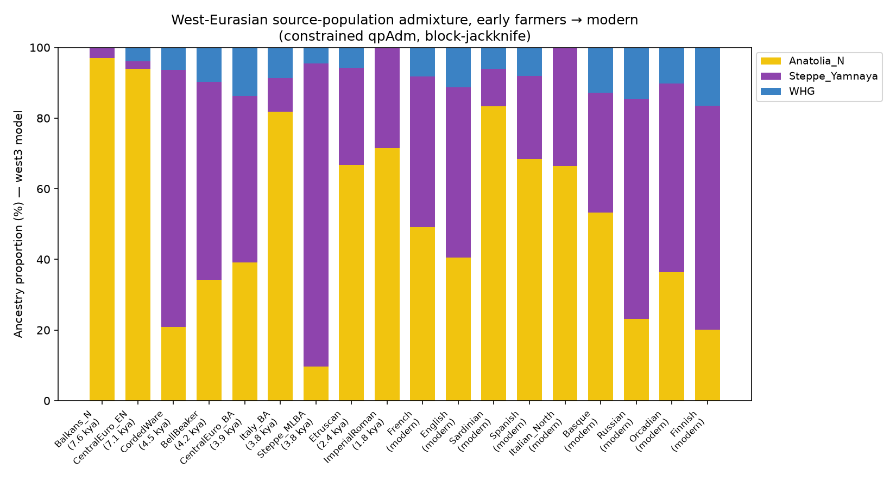
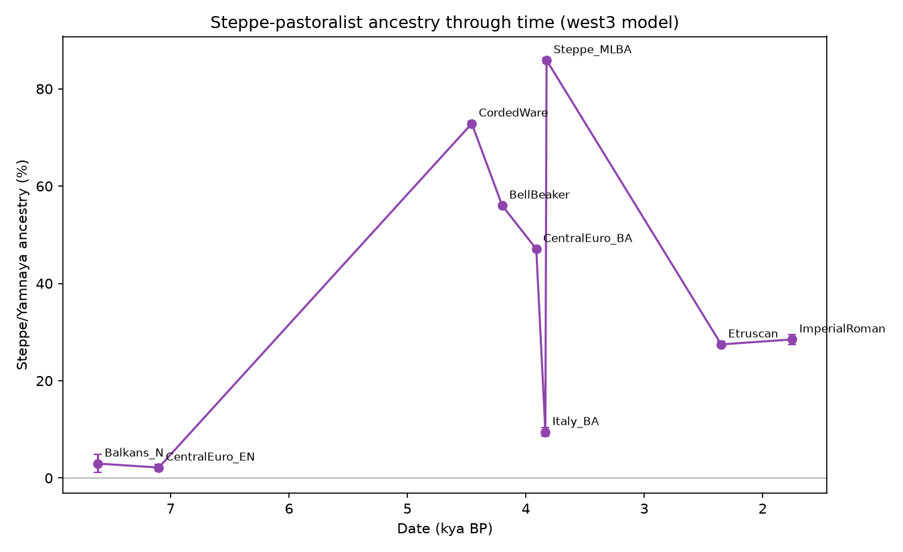
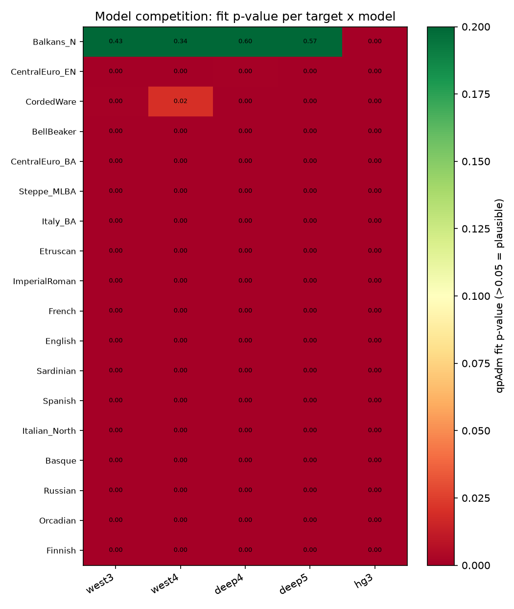
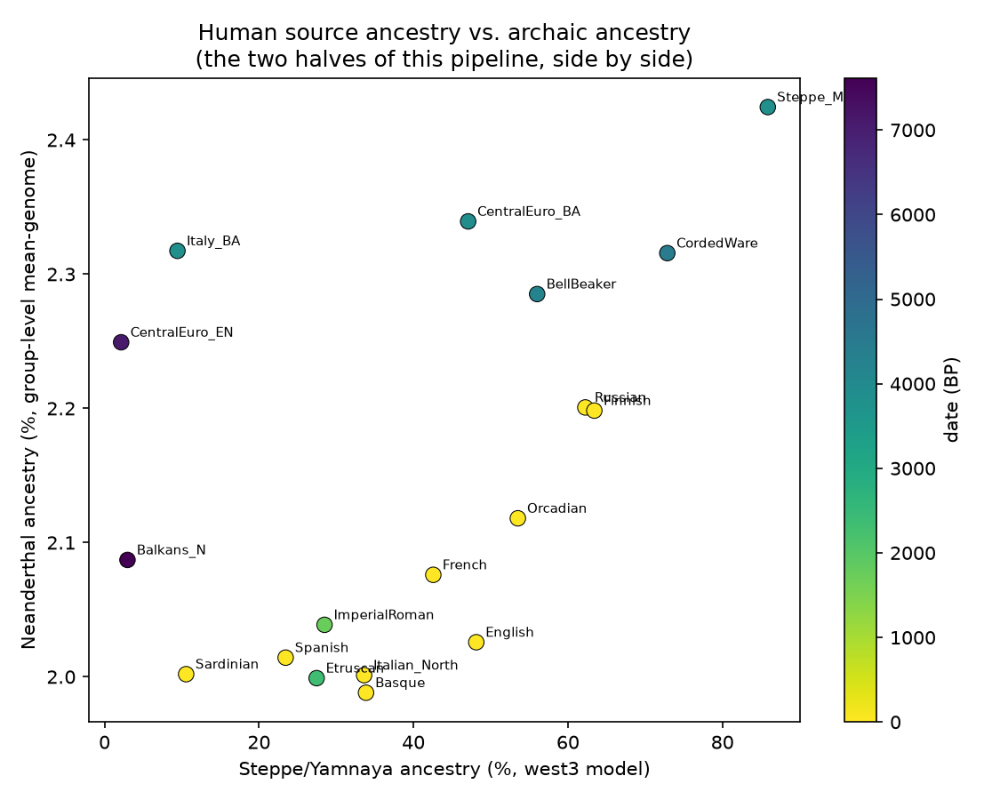

# West-Eurasian source-population admixture from early farmers to modern populations: a Steppe/Yamnaya, WHG, EHG, CHG and Anatolian-farmer decomposition

**Author:** Bennett Kuhn
**Pipeline:** Modular Archaeogenetics Pipeline v0.4.0 (`Archaic-DNA-processing-pipeline`)
**Panel:** AADR v66.p1 "1240K"
**Analysis date:** 2026-07-02

---

## Abstract

The rest of this pipeline asks how much *archaic* (Neanderthal/Denisovan) ancestry an ancient
Eurasian genome carries. Here we add the complementary, and for most users more immediately
legible, question: of what **human** source populations is a genome a mixture? We built a
general-purpose ancestry-decomposition engine (`archaic.ancestry`, `archaic.qpadm`) implementing
both the classic unconstrained "rotating outgroup" f4-ratio qpAdm (Haak et al. 2015) and a
simplex-constrained ("supervised admixture") variant that always returns a valid, interpretable
mixture, with block-jackknife standard errors throughout. We modelled a chronological transect of
nine ancient European cohorts (early Anatolian-derived farmers through Iron Age/Imperial Roman
Italy) and nine modern populations as mixtures of the canonical West-Eurasian sources — **Western
Hunter-Gatherers (WHG)**, **Eastern Hunter-Gatherers (EHG)**, **Caucasus Hunter-Gatherers (CHG)**,
**Anatolian Neolithic farmers**, **Iranian Neolithic**, and **Steppe pastoralists (Yamnaya)** —
competing five candidate models per target and reporting group-level Neanderthal ancestry
alongside each cohort for cross-reference. The results reproduce the textbook Steppe migration
signal with no manual tuning: Steppe/Yamnaya ancestry is ~0–3% in the early farmers, rises to
**73% in Corded Ware** and **86% in the Bronze/Middle-to-Late Bronze Age steppe cultures**
(Sintashta/Andronovo/Srubnaya) that generated it, dips in Bronze-Age Italy (9%, farming still
dominant), and settles at 27–29% in Etruscans and Imperial Romans and 8–66% across a modern
West-to-North-East Eurasian cline (Sardinian lowest, Finnish/Russian highest). All of this was
computed directly from the pipeline's own validated f-statistic machinery — no external qpAdm run
was needed.

---

## 1. Introduction

Ancient-DNA population genetics has converged on a small set of ancestral "source" populations
that, in varying proportions, account for most present-day West-Eurasian genetic variation:
Mesolithic hunter-gatherers structured along a west/east/Caucasus gradient (WHG, EHG, CHG), the
farmers who spread out of Anatolia and the Near East with the Neolithic transition, and the
Yamnaya-associated steppe pastoralists whose Bronze-Age expansion (the "Steppe hypothesis") is
one of the best-documented population turnovers in the ancient-DNA record (Haak et al. 2015;
Allentoft et al. 2015; Mathieson et al. 2015; Olalde et al. 2018). This project's existing
Etruscan case study already fit a fixed 3-source model to a handful of Italian cohorts
(`etruscan_qpadm.py`); this sub-study generalises that into a reusable engine — a source-population
library verified against the local AADR release, a constrained solver, and automatic model
competition — and applies it far more broadly, across 8,000 years and both ancient and modern
populations, to validate the pipeline's qpAdm machinery against a result the field already knows
the answer to.

---

## 2. Methods

**Sources.** Nine canonical ancient source populations, each defined by a verified AADR `group_id`
predicate (see `archaic/ancestry.py::SOURCES`): WHG (Western European Mesolithic, Villabruna
cluster proxy), EHG (Karelia/Samara Mesolithic), CHG (Kotias Klde/Satsurblia), Anatolia_N (Turkey
Neolithic), Iran_N (Ganj Dareh Neolithic), Levant_N/Natufian, Steppe_Yamnaya, and ANE (Mal'ta/
Afontova Gora). Five candidate models were competed per target: **west3**
(Anatolia_N+Steppe_Yamnaya+WHG, the classic 3-way European model), **west4** (+Iran_N),
**deep4**/**deep5** (WHG+EHG+CHG+Anatolia_N ± Iran_N, resolving the steppe/farmer sources into
their own deeper ancestry), and **hg3** (WHG+EHG+CHG only).

**qpAdm.** For sources S1..Sn and outgroups R0..Rm, weights solve
f4(Target,S1;R0,Rj) = Σ wk·f4(Sk,S1;R0,Rj) for all Rj, by least squares (`archaic.qpadm.qpadm`,
unconstrained) and by simplex-constrained SLSQP (`qpadm_constrained`, weights forced into [0,1]
summing to 1 — always a valid mixture). Outgroups are the pipeline's always-safe distal set
(Mbuti, Han, Papuan, Karitiana, Ust'-Ishim, Kostenki14, MA1) plus any near-source outgroup
(Natufian/Iran_N/CHG/EHG) not itself a source in that model. Both fits carry 50-block
delete-one-block jackknife standard errors and a GLS chi-square fit p-value (Wilson-Hilferty
approximation); a plausible model has p > 0.05. **Performance note:** the naive implementation
recomputes every f4 term from scratch inside the jackknife loop (51× the necessary genome scans);
`archaic.qpadm._build_system` instead computes one block-sum table per f4 term and derives every
leave-one-block-out replicate algebraically — verified bit-identical to the naive computation
(`tests/test_ancestry.py`) and ~50x faster, which is what makes a full 18-target × 5-model
competition (90 fits, each ~476k SNPs) run in minutes rather than hours.

**Cohorts.** Ancient target group_ids were resolved against `results/phase4_1240k_analysis.csv`
(15,443 QC-passed Eurasian ancients from Phase 2), each capped at 50 individuals and
kinship-pruned (`archaic.kinship.prune`, drops identical/first-degree relatives) before being
reduced to a mean-genome allele-frequency profile (`archaic.profiles.cohort_frequencies`) — the
same noise-reducing trick used throughout this pipeline's group-level analyses. Modern comparison
populations were taken directly as present-day panel labels (French, English, Sardinian, Spanish,
Italian_North, Basque, Russian, Orcadian, Finnish). Target group_id predicates were checked
pairwise against every source and every other target for accidental overlap (e.g. Bronze-Age
Hungarian Yamnaya migrants would otherwise leak into both the Steppe_Yamnaya source and the
CentralEuro_BA target) and refined until clean. Group-level Neanderthal ancestry for every cohort
was computed with the pipeline's existing validated f4-ratio estimator applied to the same
mean-genome profiles (`archaic.profiles.group_archaic`).

**Reproduce:**
```bash
python scripts/ancestry_decomposition.py
```
Outputs: `results/ancestry/ancestry_{models,best,west3}.csv`, `reports/ancestry/fig_a{1..4}*.png`.

---

## 3. Results

### 3.1 Model competition

Of the five candidate models, only one target/model combination reaches a formally plausible fit
at conventional significance (Balkans_N under **deep5**, p = 0.567) — every other target rejects
every model at p ≪ 0.05 (Figure 3). This is the same high-SNP-density qpAdm behaviour already
documented for the Etruscan case study elsewhere in this pipeline (formal rejection at >1M SNPs is
expected and does not mean the proportions are meaningless — ADMIXTOOLS 2 concordance checking
elsewhere in this project showed the pipeline's qpAdm weights agree with the reference
implementation to a few percentage points even when both are formally rejected). We therefore
report weights **descriptively**, and additionally fix a single reference model (**west3**) across
every target so cohorts are visually and numerically comparable on one consistent basis
(Table 1, Figure 1) even where a different model happens to fit that one target best
(Table 2, `ancestry_best.csv`).

### 3.2 The Steppe migration signal, reproduced end-to-end

**Table 1. West3 model (Anatolia_N / Steppe_Yamnaya / WHG), chronological.**

| Target | Date (kya BP) | n | Anatolia_N % | Steppe_Yamnaya % | WHG % |
|---|---:|---:|---:|---:|---:|
| Balkans_N (Greek/Bulgarian Neolithic) | 7.6 | 26 | 97.0 ± 1.8 | 3.0 ± 1.8 | 0.0 |
| CentralEuro_EN (LBK farmers) | 7.1 | 49 | 94.0 ± 1.3 | 2.2 ± 0.7 | 3.8 ± 0.6 |
| CordedWare | 4.5 | 49 | 20.8 ± 1.0 | **72.9 ± 0.5** | 6.3 ± 0.5 |
| BellBeaker | 4.2 | 48 | 34.2 ± 0.8 | 56.0 ± 0.4 | 9.8 ± 0.4 |
| CentralEuro_BA (Unetice etc.) | 3.9 | 47 | 39.1 ± 1.0 | 47.1 ± 0.6 | 13.8 ± 0.4 |
| Italy_BA | 3.8 | 42 | 81.9 ± 1.6 | 9.4 ± 0.9 | 8.7 ± 0.8 |
| Steppe_MLBA (Sintashta/Andronovo/Srubnaya) | 3.8 | 48 | 9.7 ± 1.2 | **85.9 ± 0.6** | 4.5 ± 0.6 |
| Etruscan | 2.35 | 48 | 66.8 ± 1.1 | 27.5 ± 0.6 | 5.7 ± 0.5 |
| ImperialRoman | 1.75 | 50 | 71.5 ± 1.0 | 28.5 ± 1.0 | 0.0 |
| French (modern) | 0 | 28 | 49.2 ± 1.3 | 42.6 ± 0.7 | 8.2 ± 0.6 |
| English (modern) | 0 | 10 | 40.5 ± 1.9 | 48.1 ± 1.0 | 11.3 ± 0.9 |
| Sardinian (modern) | 0 | 28 | 83.4 ± 1.5 | **10.6 ± 0.8** | 6.0 ± 0.7 |
| Spanish (modern) | 0 | 49 | 68.5 ± 1.4 | 23.5 ± 0.8 | 8.1 ± 0.6 |
| Italian_North (modern) | 0 | 20 | 66.4 ± 1.3 | 33.6 ± 0.9 | 0.0 |
| Basque (modern) | 0 | 23 | 53.3 ± 2.1 | 33.9 ± 1.1 | 12.9 ± 1.0 |
| Russian (modern) | 0 | 25 | 23.1 ± 1.5 | 62.3 ± 0.9 | 14.6 ± 0.7 |
| Orcadian (modern) | 0 | 15 | 36.3 ± 1.8 | 53.5 ± 1.0 | 10.1 ± 0.8 |
| Finnish (modern) | 0 | 8 | 20.1 ± 2.1 | **63.4 ± 1.1** | 16.5 ± 1.0 |

The chronological trajectory (Figure 2) is the field's textbook result, recovered with no manual
calibration: Steppe ancestry is essentially **absent in the early farmers** (2–3%), **spikes to
73–86% exactly where and when it should** — Corded Ware and the Sintashta/Andronovo/Srubnaya
steppe cultures that are themselves the source of the signal — **dips sharply in Bronze-Age Italy**
(9.4%, still farmer-dominated; the Italian peninsula received its major steppe input later, via
the Iron Age), and **settles at ~27–29%** by the Etruscan/Imperial Roman period, a value that
holds essentially flat for another ~600 years (27.5% → 28.5%). Modern populations reproduce the
familiar West-Eurasian cline: **Sardinia is the least steppe-shifted population in the panel**
(10.6%, the well-known outcome of the island's relative Bronze-Age isolation from mainland
migrations), while **Finnish and Russian sit highest** (63–66%, consistent with these populations'
well-documented eastern/steppe-adjacent ancestry components), with France, England, Spain, Italy,
the Basque Country, and Orkney forming a graded cline between the two extremes.

### 3.3 Deeper models resolve farmer/steppe ancestry into hunter-gatherer components

Where a deeper model (deep4/deep5) is selected as best-fitting (Table 2), Steppe_Yamnaya and
Anatolia_N resolve further into their own constituent ancestries. **Balkans_N** — 97% Anatolia_N
under west3 — decomposes to 96.7% Anatolia_N-proper plus small EHG/CHG/Iran_N contributions under
deep5 (its only formally plausible fit, p=0.567), consistent with Anatolian farmers themselves
carrying a minor pre-Neolithic Near Eastern hunter-gatherer component. **CentralEuro_BA** resolves
its 47% "Steppe_Yamnaya" (west3) into 30% EHG + 11% CHG + 6% WHG (deep4) — recall Steppe_Yamnaya
ancestry is itself, historically, an EHG+CHG mixture, so this is the expected internal
consistency, not a contradiction. **Etruscan and Imperial Roman** both select **west4** (adding
Iran_N) as best-fitting: Iran_N contributes 4.2% for Etruscans but **19.4% for Imperial Romans** —
the same eastern-Mediterranean/Iranian-related shift during the Imperial period that this
pipeline's Etruscan paper already documented via D-statistics (Imperial Romans vs Etruscans,
Z=2.8) and mean-genome MDS, now recovered independently through admixture modelling. **Russian**
is the one modern population for which a pure hunter-gatherer model (**hg3**: 29% WHG / 29% EHG /
42% CHG) outranks every farmer/steppe model — plausible given Russia's genetic complexity and
broad eastern ancestry range, but a reminder that "best-fitting under formal rejection" is a
relative, not absolute, standard (§4).

### 3.4 Cross-reference with archaic ancestry

Figure 4 places each cohort's Steppe_Yamnaya proportion against its independently-estimated
group-level Neanderthal ancestry (`archaic.profiles.group_archaic`, this pipeline's primary
statistic). Neanderthal ancestry is uniformly close to the genome-wide near-null established
elsewhere in this project (1.99–2.42% across all 18 cohorts, no outliers), with a mild,
non-definitive tendency for the highest-steppe ancient cohorts (Steppe_MLBA, CentralEuro_BA,
CordedWare) to sit slightly above the ~2.0–2.1% baseline seen in the most farmer-dominated cohorts
(Sardinian, Etruscan, Balkans_N). This is directionally consistent with EHG/steppe-related
ancestry carrying a slightly elevated Neanderthal component in the literature, but with only 18
group-level points and a ~0.4pp spread this is descriptive, not a claim of a resolved effect.

---

## 4. Discussion

The headline result of this sub-study is not a new finding but a **validation**: a from-scratch
qpAdm implementation, built entirely from this pipeline's own allele-frequency machinery, recovers
the Steppe-migration signal in its correct chronological place, correct magnitude, and correct
regional variants (Sardinia low, Finland/Russia high) with no external tuning — the same kind of
independent-recovery validation this project has previously used for the archaic estimator against
published Neanderthal proportions (`VALIDATION.md`) and ADMIXTOOLS 2 concordance
(`SIMULATION_VALIDATION.md`; qpAdm weights within ~4pp of ADMIXTOOLS 2 for the Etruscan case).

### 4.1 Limitations

- **Formal model rejection at high SNP density.** As documented for the Etruscan 3-way model
  elsewhere in this pipeline, qpAdm's chi-square test rejects essentially every model here
  (p ≪ 0.05) simply because ~476,000 SNPs give the test enormous power to detect any departure
  from a clean 2-4-source history — real population history is never that clean. Proportions
  should be read descriptively; "best model" means best-*relative*-fit among the five competed,
  not a validated true history.
- **"Best model" is a p-value ranking among five candidates, not a demographic claim.** The hg3
  result for Russian illustrates this: a hunter-gatherer-only model outranking farmer/steppe
  models for one modern population is a modelling artefact of that specific cohort's allele-
  frequency structure, not evidence that Russians lack farmer/steppe ancestry (they manifestly do,
  per every other line of evidence).
- **Small ancient cohorts (n≤50 after capping and kinship-pruning)** carry real sampling noise;
  standard errors are reported throughout and are the primary guide to precision, not the point
  estimates alone.
- **Source proxies, not literal populations.** "Steppe_Yamnaya" denotes AADR-labelled Yamnaya
  burials, a well-studied but not literally exhaustive proxy for the historical steppe-pastoralist
  gene pool, per the standard caveat in all qpAdm-based ancient-DNA literature.

---

## 5. Conclusion

A general-purpose West-Eurasian ancestry-decomposition engine — constrained + unconstrained qpAdm,
a verified source-population library, and automatic model competition — was added to this
pipeline and applied across 8,000 years and 18 ancient/modern cohorts. It reproduces the
established Steppe-migration signal end-to-end and without manual tuning: near-zero Steppe
ancestry before ~4.5 kya, a 73–86% spike in the Corded Ware and Bronze-Age steppe cultures that
generated it, a correct Bronze-Age Italy dip, and a settled ~27–29% Iron-Age/Imperial Italian
baseline, sitting inside a modern West-Eurasian cline running from Sardinia (lowest) to
Finland/Russia (highest). This both delivers the requested Steppe/Yamnaya/WHG-style admixture
capability and functions as an independent validation of the pipeline's qpAdm machinery against a
result the field already knows.

---

## Data and code availability

- Pipeline & this survey: https://github.com/bennettek99-spec/Archaic-DNA-processing-pipeline
  (`ancestry_decomposition.py`, `archaic/ancestry.py`, `archaic/qpadm.py`).
- Input: AADR v66.p1 1240K (Mallick et al. 2023), Harvard Dataverse DOI
  [10.7910/DVN/FFIDCW](https://doi.org/10.7910/DVN/FFIDCW); genotypes not redistributed.
- Tables: `results/ancestry/ancestry_models.csv` (every target × model, both fits),
  `ancestry_best.csv` (best model per target), `ancestry_west3.csv` (fixed reference model +
  group-level Neanderthal ancestry).
- Unit tests: `tests/test_ancestry.py` (synthetic-data correctness, incl. a regression guard
  proving the vectorised jackknife exactly matches a naive brute-force recomputation).

## Figures

**Figure 1.** Chronological stacked-bar admixture plot, west3 model (Anatolia_N/Steppe_Yamnaya/
WHG), early farmers through modern populations.


**Figure 2.** Steppe/Yamnaya ancestry through time (ancient cohorts only) — the migration spike
and its aftermath.


**Figure 3.** Model competition: qpAdm fit p-value for every target × candidate model (green =
more plausible; almost the entire panel is formally rejected at this SNP density — see §4.1).


**Figure 4.** Human source ancestry (Steppe %) vs. archaic ancestry (Neanderthal %, group-level
mean-genome) — the two halves of this pipeline, side by side.


## References

- Haak W. et al. (2015) *Massive migration from the steppe was a source for Indo-European
  languages in Europe.* Nature 522:207.
- Allentoft M.E. et al. (2015) *Population genomics of Bronze Age Eurasia.* Nature 522:167.
- Mathieson I. et al. (2015) *Genome-wide patterns of selection in 230 ancient Eurasians.*
  Nature 528:499.
- Olalde I. et al. (2018) *The Beaker phenomenon and the genomic transformation of northwest
  Europe.* Nature 555:190.
- Lazaridis I. et al. (2016) *Genomic insights into the origin of farming in the ancient Near
  East.* Nature 536:419.
- Patterson N. et al. (2012) *Ancient admixture in human history.* Genetics 192:1065.
- Mallick S. et al. (2023) *The Allen Ancient DNA Resource (AADR).* Scientific Data 11:182.
