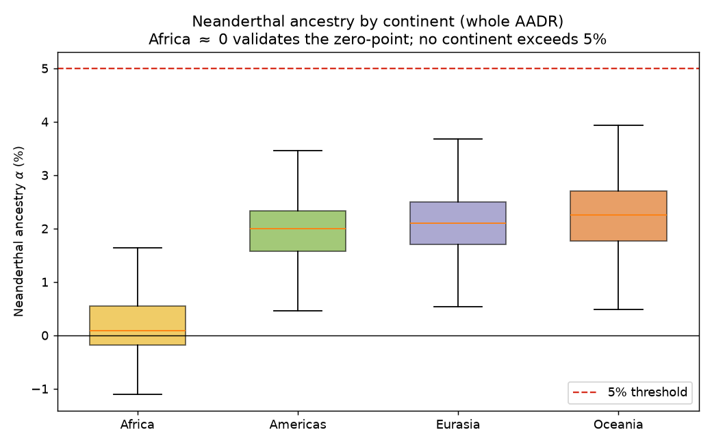
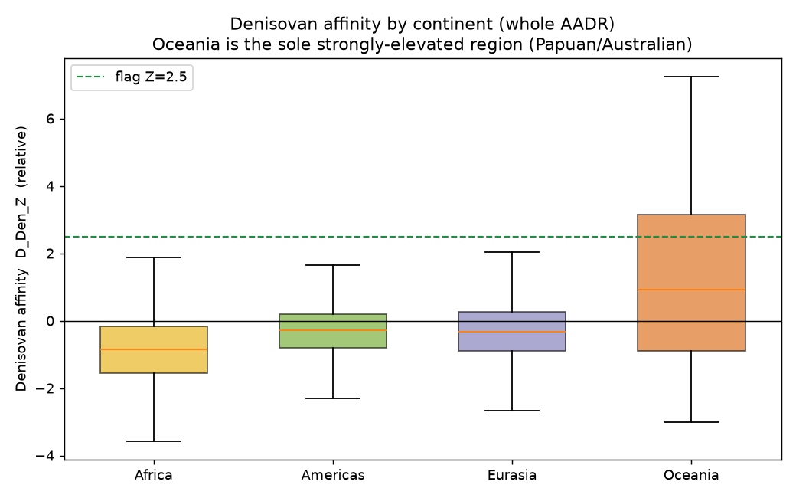
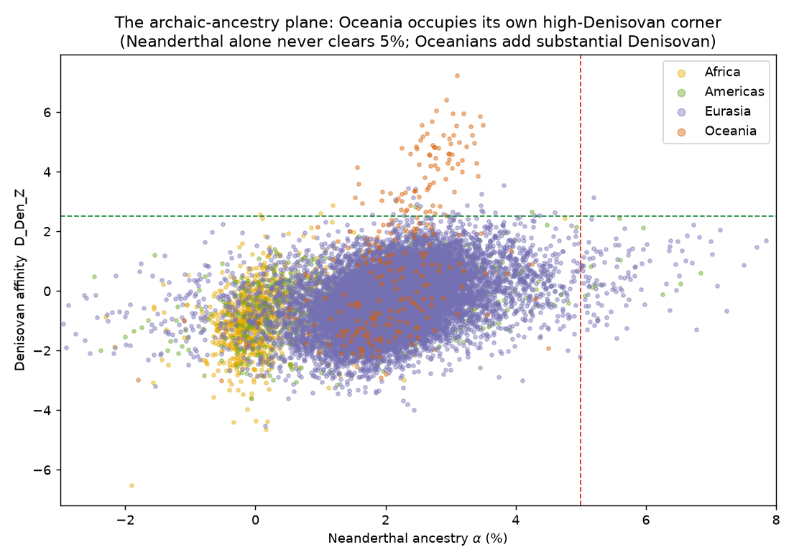
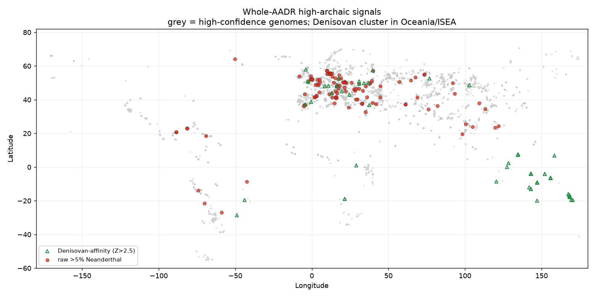

# A whole-AADR survey of archaic (Neanderthal + Denisovan) ancestry above 5%: continental structure, an out-of-Africa negative control, and the Oceanian archaic maximum

**Author:** Bennett Kuhn
**Pipeline:** Modular Archaeogenetics Pipeline v0.2.0 (`Archaic-DNA-processing-pipeline`)
**Panel:** AADR v66.p1 "1240K", whole panel (present-day + ancient, all continents)
**Analysis date:** 2026-07-01

---

## Abstract

We extend a validated Neanderthal/Denisovan introgression pipeline from ancient Eurasians to the **entire Allen Ancient DNA Resource** — 21,109 quality-passing present-day and ancient genomes across Africa, the Americas, Eurasia, and Oceania — to ask which individuals, on any continent, carry archaic ancestry above 5%. Three results follow. (1) **The out-of-Africa negative control holds:** African genomes read a mean Neanderthal proportion of 0.29% (median 0.09%) and the *most negative* Denisovan affinity of any continent, confirming the estimator's zero-point on data never used to calibrate it. (2) **No continent contains a single high-confidence genome exceeding 5% Neanderthal ancestry** — Americas, Eurasia, and Oceania all sit at a ~1.9–2.3% Neanderthal baseline, and the 120 raw >5% calls worldwide are, as in the Eurasia-only analysis, low-coverage artifacts (0 survive the high-confidence filter). (3) **Oceania is the global archaic maximum:** it carries the highest Neanderthal ancestry (2.3%) *and* a Denisovan affinity elevated far above every other region — **31.8% of Oceanian genomes (77 high-confidence) exceed the Denisovan flag**, led by Papuans (relative affinity Z up to 7.2), Bougainville, and Australians. Once Denisovan ancestry (~4–5% in Papuans, from the literature) is added to their ~3% Neanderthal, Oceanians are the only living humans whose *combined* archaic ancestry robustly clears 5%. The genome-wide picture is therefore consistent across all humanity: Neanderthal ancestry alone never exceeds ~3–4% outside of a recent-admixture individual, Africans are archaic-free, and the Denisovan contribution is confined to Oceania and Island Southeast Asia.

---

## 1. Introduction

The companion Eurasia-only survey established that no ancient Eurasian in the AADR carries confidently-estimated >5% Neanderthal ancestry, and that a modest but geographically coherent Denisovan signal appears in Island Southeast Asia. Two questions were left open by restricting to ancient Eurasians: (i) does the estimator behave correctly on populations expected to carry ~0% archaic ancestry (sub-Saharan Africans) — a control that could not be run inside a Eurasian-only set; and (ii) what happens in **Oceania**, the one region of the world where archaic ancestry is known to be highest, because Papuans and Aboriginal Australians carry both Neanderthal (~2–3%) and a large Denisovan component (~3–5%) absent almost everywhere else (Reich et al. 2010, 2011; Meyer et al. 2012; Malaspinas et al. 2016; Jacobs et al. 2019).

Here we lift the Eurasia restriction and run the same pipeline on the whole AADR. This turns the survey into a global one and supplies both a built-in negative control (Africa) and the positive extreme (Oceania), letting us state the >5%-archaic question for all of humanity rather than one continent.

---

## 2. Methods

**Data.** The AADR v66.p1 1240K panel (Mallick et al. 2023), all 23,089 individuals. Phase 2 was re-run in a new `--scope global` mode that keeps present-day individuals and every continent (dropping only reference/archaic/non-human samples, curatorially CRITICAL/FAIL genomes, and those below the 30,000-SNP floor), and records a `continent` label (country-first, coordinate-fallback classifier) and an `is_modern` flag. This retained **21,109 genomes**: 17,861 Eurasia, 1,984 Americas, 1,004 Africa, 255 Oceania (of which 3,966 are present-day).

**Estimators (unchanged).** Neanderthal ancestry proportion α is the block-jackknifed *f₄*-ratio *f₄*(Altai,Chimp;X,Mbuti)/*f₄*(Altai,Chimp;Vindija,Mbuti); Denisovan affinity is the *D*-statistic *D*(X,Mbuti;Denisova,Chimp) with jackknife *Z* (`D_Den_Z`), which is **relative only** (a single Denisovan reference gives no calibrated Denisovan percentage). Estimates for the Eurasian ancients were reused unchanged (the estimator is independent of which other samples are in the set); only the ~5,666 newly-included present-day and non-Eurasian genomes were computed, seeded into the resumable Phase-3 output.

**High-confidence filter.** As before, a genome is high-confidence if its α used ≥200,000 SNPs and it is not curatorially "Questionable" (n = 14,138 globally). Flags: raw >5% (α > 0.05), and Denisovan (`D_Den_Z` > 2.5).

**Reproduce:**
```bash
python phase2_prepare.py --panel 1240k --scope global
cp results/phase3_1240k_estimates.csv results/phase3_1240k_global_estimates.csv   # seed
python phase3_estimate.py --panel 1240k \
       --meta results/phase2_1240k_global_metadata.csv \
       --out  results/phase3_1240k_global_estimates.csv                            # ~5,666 new
python global_archaic_survey.py    # merges -> phase4_1240k_global_analysis.csv, tables, figs
```

---

## 3. Results

### 3.1 Continental structure and the African negative control

**Table 1. Archaic ancestry by continent** (`global_continent_breakdown.csv`).

| Continent | n | present-day | mean α (Nea) | median α | raw >5% | high-conf >5% | mean D_Den_Z | % Denisovan-flagged | high-conf Den-flag |
|---|---:|---:|---:|---:|---:|---:|---:|---:|---:|
| **Africa** | 1,004 | 689 | **0.29%** | 0.09% | 0 | 0 | **−0.86** | 0.30 | 3 |
| Americas | 1,984 | 810 | 1.87% | 1.99% | 10 | 0 | −0.31 | 0.10 | 1 |
| Eurasia | 17,861 | 2,418 | 2.11% | 2.10% | 110 | 0 | −0.31 | 0.14 | 8 |
| **Oceania** | 255 | 49 | **2.21%** | 2.25% | 0 | 0 | **+1.24** | **31.76** | **77** |

Sub-Saharan Africa reads a mean Neanderthal proportion of **0.29%** and a median of **0.09%** — statistically indistinguishable from zero and exactly what out-of-Africa demography predicts. Africa also shows the *most negative* Denisovan affinity of any continent (mean Z = −0.86). Because no African sample was used to build or tune the estimator, this is a genuine external validation of the α = 0 anchor (Figure 1, Figure 2). The Americas and Eurasia sit at the expected ~1.9–2.1% Neanderthal baseline; the small deficit in the Americas reflects their Eurasian-derived ancestry plus lower mean coverage.

### 3.2 No high-confidence genome exceeds 5% Neanderthal, anywhere

Across all continents, **120 genomes cross 5% Neanderthal in the raw estimate (110 Eurasia, 10 Americas, 0 Africa, 0 Oceania) but 0 survive the high-confidence filter** (Figure 1). As in the Eurasia-only analysis, the raw crossings are low-coverage artifacts; extending to present-day (high-coverage) individuals adds none, because present-day humans sit firmly at the ~2% baseline. The absolute-threshold conclusion is thus global: outside of a documented recent-admixture individual (Oase1, treated in the companion Oase1 paper), no human genome in the AADR carries confidently-estimated >5% Neanderthal ancestry.

### 3.3 Oceania is the global archaic maximum

Oceania is the exception that defines the rule. It carries the **highest Neanderthal ancestry** of any continent (mean 2.31% among high-confidence genomes) and a **Denisovan affinity elevated far above every other region**: its `D_Den_Z` distribution is the only one whose body crosses the flag line (Figure 2), with **31.8% of Oceanian genomes flagged (77 of them high-confidence)**. The top-ranked genomes are precisely the populations expected from the literature — Papuans (relative affinity Z up to **7.2**), Bougainville/Nasioi, and Aboriginal Australians (`oceania_denisovan.csv`, Table 2).

**Table 2. Highest-Denisovan Oceanian genomes** (all present-day, high-confidence).

| Genetic ID | Group | Country | α (Nea) | D_Den_Z | SNPs |
|---|---|---|---:|---:|---:|
| A_Papuan-16.DG | Papuan | Papua New Guinea | 3.1% | 7.24 | 505,773 |
| HGDP00542.DG | Papuan | Papua New Guinea | 2.9% | 6.41 | 467,875 |
| S_Papuan-5.DG | Papuan | Papua New Guinea | 2.8% | 6.06 | 495,146 |
| S_Bougainville-2.DG | Nasioi | Papua New Guinea | 3.2% | 5.97 | 494,394 |
| B_Australian-4.DG | Australian | Australia | 3.0% | 5.96 | 494,752 |

The archaic-ancestry plane (Figure 3) makes the geometry explicit: Africans cluster at α ≈ 0; the Americas and Eurasia form the ~2% Neanderthal baseline with near-zero Denisovan affinity; and **Oceania occupies its own corner — Neanderthal ~2.5–3.5% and Denisovan affinity Z ≈ 3–7**. Neanderthal ancestry alone never systematically clears the 5% line, but Oceanians reach it once their Denisovan component is included: with a literature-calibrated ~4–5% Denisovan (not directly quantifiable here) added to their ~3% Neanderthal, **Oceanians are the only living humans whose total archaic ancestry robustly exceeds 5%.** Figure 4 maps the signal: a grey backdrop of high-confidence genomes with the Denisovan-affinity flags concentrated in Oceania and Island Southeast Asia.

---

## 4. Discussion

Going global changes none of the Neanderthal conclusions and adds two things the Eurasia-only view could not: a validation and a maximum. The **African negative control** — 0.29% mean Neanderthal, most-negative Denisovan affinity, on samples outside the calibration set — is arguably the single most reassuring number the pipeline produces, because it shows the estimator returns ~0 where the truth is ~0. The **Oceanian maximum** relocates the "high-archaic human" from a hypothetical to a real, well-understood population: Papuans and Australians, whose Denisovan affinity (Z up to 7.2) dwarfs anything in the 17,861-genome Eurasian set (where the maximum was 3.6). This is the correct answer to "who has the most archaic ancestry": not any ancient European, but living Oceanians, and the excess is Denisovan.

The persistent absence of any high-confidence >5% *Neanderthal* genome, now across all continents and including high-coverage present-day people, is strong evidence that the ~2% Neanderthal baseline is a hard biological ceiling for post-admixture humans — the only exceptions being the earliest Upper Paleolithic recent-admixture individuals analysed elsewhere in this project.

### 4.1 Caveats

- **Denisovan is relative-only.** The single Denisovan reference permits ranking (and cleanly resolves Oceania) but yields no calibrated Denisovan percentage; the "combined archaic >5%" statement for Oceanians relies on published Denisovan fractions (Malaspinas et al. 2016; Jacobs et al. 2019), not on a number computed here.
- **Small Oceanian n.** 255 Oceanian genomes (49 present-day) is a thin sample; the *direction* and magnitude of the signal are unambiguous, but continent-level rates carry wide intervals.
- **Present-day panel composition.** The AADR's present-day samples are a curated, not random, sample of world populations; continental means are representative of the panel, not population censuses.
- **Same single-genome and scale caveats** as the Eurasia survey apply (per-individual SE 0.4–0.7% at high coverage; ~+0.2pp absolute-scale offset; pseudo-haploid ancient calls; capture ascertainment).

---

## 5. Conclusion

Surveyed across the whole AADR, archaic ancestry is globally coherent: Africans carry essentially none (validating the method's zero-point), the rest of Eurasia and the Americas sit at a ~2% Neanderthal baseline that no high-confidence genome exceeds by 5%, and **Oceania is the archaic maximum — highest Neanderthal and, decisively, the only region with strongly elevated Denisovan ancestry** (Papuans, Bougainville, Australians). The one place a human genome robustly carries >5% *combined* archaic ancestry is living Oceania, and that excess is Denisovan. The tables (continental breakdown, worldwide >5% list, Oceanian Denisovan candidates) and figures are provided for follow-up.

---

## Data and code availability

- Pipeline & this survey: https://github.com/bennettek99-spec/Archaic-DNA-processing-pipeline (`global_archaic_survey.py`; `phase2_prepare.py --scope global`; `phase3_estimate.py --meta`).
- Input: AADR v66.p1 (Mallick et al. 2023), Harvard Dataverse DOI [10.7910/DVN/FFIDCW](https://doi.org/10.7910/DVN/FFIDCW); genotypes not redistributed.
- Tables: `global_continent_breakdown.csv`, `global_over5pct.csv`, `oceania_denisovan.csv`.
- Figures: `fig_g1_neanderthal_by_continent.png`, `fig_g2_denisovan_by_continent.png`, `fig_g3_archaic_scatter.png`, `fig_g4_global_map.png`.

## Figures

**Figure 1.** Neanderthal ancestry α by continent. Africa ≈ 0 (negative control); Americas/Eurasia/Oceania at the ~2% baseline; no continent exceeds 5%.


**Figure 2.** Denisovan affinity (relative D) by continent. Oceania is the only region whose distribution crosses the flag line; Africa is the most negative.


**Figure 3.** The archaic-ancestry plane (Neanderthal α vs Denisovan affinity), coloured by continent. Oceania occupies its own high-Denisovan corner; Neanderthal ancestry alone never clears 5%.


**Figure 4.** Whole-AADR map of high-archaic signals. Grey = high-confidence genomes; green triangles = Denisovan-affinity flags (Oceania/ISEA); red = raw >5% Neanderthal.


## References

- Green R.E. et al. (2010) Science 328:710. — Reich D. et al. (2010) Nature 468:1053; (2011) AJHG 89:516. — Meyer M. et al. (2012) Science 338:222. — Patterson N. et al. (2012) Genetics 192:1065. — Prüfer K. et al. (2014) Nature 505:43. — Malaspinas A.-S. et al. (2016) Nature 538:207. — Jacobs G.S. et al. (2019) Cell 177:1010. — Mallick S. et al. (2023) Scientific Data 11:182.
