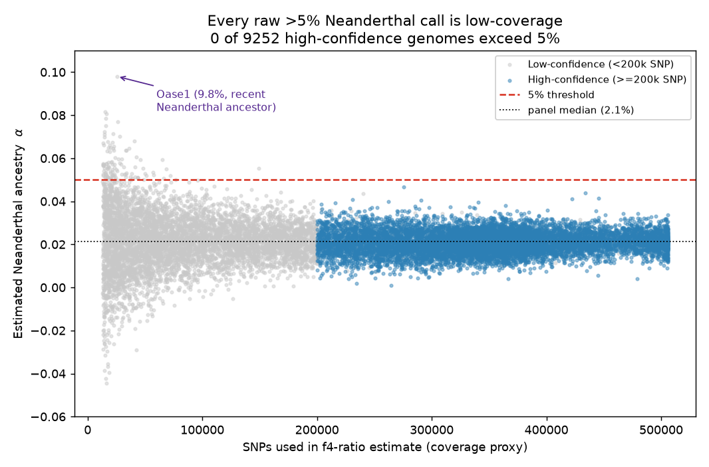
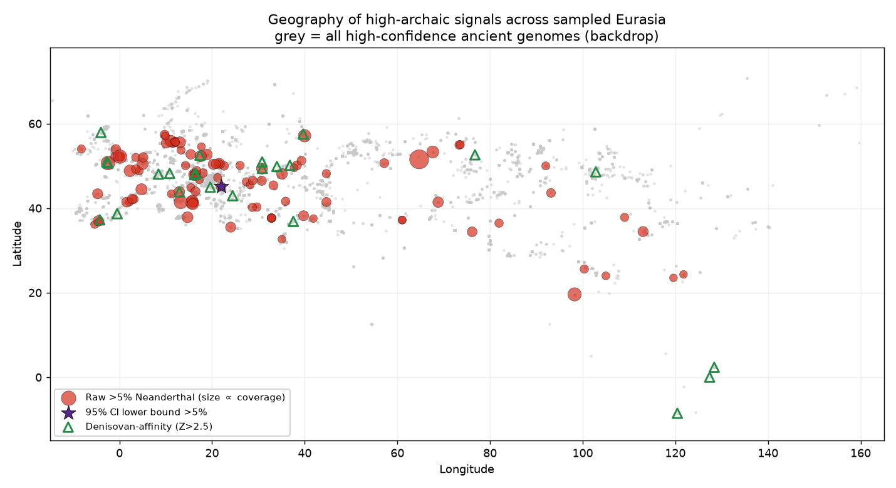
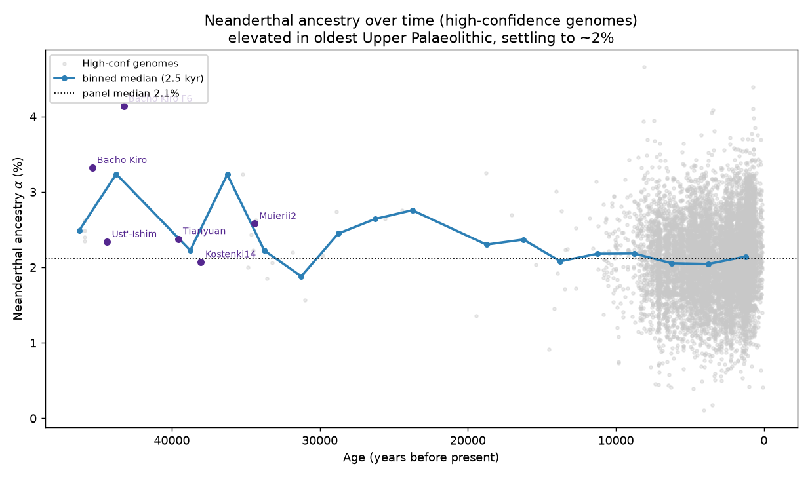
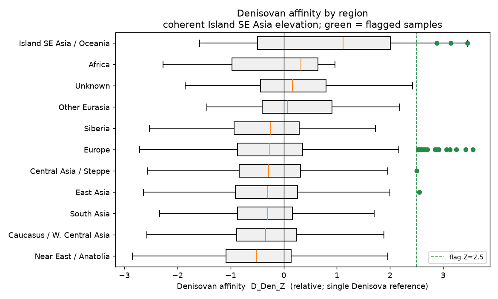

# A survey of ancient and modern Eurasian genomes for individuals exceeding 5% archaic (Neanderthal / Denisovan) ancestry in the Allen Ancient DNA Resource

**Author:** Bennett Kuhn
**Pipeline:** Modular Archaeogenetics Pipeline v0.2.0 (`Archaic-DNA-processing-pipeline`)
**Panel:** AADR v66.p1 "1240K" (23,089 individuals × 1,233,013 autosomal-informative SNPs)
**Analysis date:** 2026-07-01

---

## Abstract

Present-day non-African humans carry ~1.5–3% Neanderthal ancestry, and populations of Oceanian / Island Southeast Asian descent additionally carry ~2–5% Denisovan ancestry. Individuals substantially exceeding these baselines are rare and biologically interesting: they signal either a recent (few-generation) archaic ancestor or, more often, a technical artifact. Here we screen **15,443 quality-controlled Eurasian ancient genomes** from the Allen Ancient DNA Resource (AADR) for individuals whose estimated archaic ancestry exceeds an **absolute 5% threshold**, using a previously validated allele-frequency *f₄*-ratio estimator (validated three independent ways: against published values r = 0.87, against coalescent simulation slope = 0.97·true, and against ADMIXTOOLS 2 f-statistics r ≥ 0.99). We find that **110 individuals cross 5% Neanderthal ancestry in the raw estimate, but zero do so among the 9,252 high-confidence (≥200,000-SNP) genomes.** Every raw >5% call is a low-coverage sample (median 21,604 SNPs vs. 272,044 panel-wide); the threshold-crossings are driven by estimator variance, not biology. The single genome whose 95% confidence interval excludes 5% is **Oase1** (Romania, ~40,000 BP; α = 9.8%), an Initial Upper Paleolithic individual independently known to have a Neanderthal ancestor 4–6 generations back. Genome-wide Neanderthal ancestry is **elevated (~2.5–3.2%) in the oldest Upper Paleolithic** (Bacho Kiro, Ust'-Ishim, Goyet, Peștera Muierii) and settles to a ~2.1% Holocene baseline, reproducing the known post-admixture decline. For the Denisovan source, a relative D-statistic isolates a **geographically coherent Island Southeast Asian (Indonesian) cluster** — three high-confidence Holocene genomes (AMA009, LIT001, Uattamdi1) — consistent with the known Papuan/ISEA Denisovan cline, though no sample reaches an absolute 5% Denisovan level at this resolution. We conclude that, at single-genome AADR resolution, **>5% archaic ancestry in a Eurasian individual is essentially always either a low-coverage artifact or an earliest-Upper-Paleolithic recent-admixture case**, and we provide the flagged sample lists, a regional breakdown, source attribution, and a temporal reconstruction.

---

## 1. Introduction

Anatomically modern humans dispersing out of Africa interbred with at least two archaic hominin lineages: Neanderthals (a single major pulse ~50–60 kya, plus minor later contributions) and Denisovans (one or more pulses in the ancestors of Oceanian and East/Southeast Asian populations). The resulting introgression is quantitatively stable across most of Eurasia — roughly 2% Neanderthal in West Eurasians, slightly higher in East Asians, and up to ~5% Denisovan in Papuans and Aboriginal Australians (Green et al. 2010; Reich et al. 2010; Meyer et al. 2012; Prüfer et al. 2014; Vernot & Akey 2014; Sankararaman et al. 2016).

Because this baseline is narrow, an individual carrying *substantially* more archaic ancestry is a flag worth raising. Two biological scenarios produce it: (i) a **recent archaic ancestor** — the Oase1 individual from Romania carried ~6–9% Neanderthal ancestry in long genomic blocks, implying a Neanderthal great-great-grandparent (Fu et al. 2015); and (ii) the **earliest Upper Paleolithic**, when the population-wide Neanderthal fraction was still higher before purifying selection eroded it over the following millennia (Fu et al. 2016; Petr et al. 2019). A third, non-biological scenario — low sequencing coverage or modern human contamination — inflates variance and can push a low-quality estimate past any fixed threshold. Distinguishing these is the analytical task of this study.

This paper repurposes an existing, validated introgression pipeline to answer a deliberately simple question: **across all Eurasian genomes in the AADR, who exceeds 5% archaic ancestry, where are they, from which archaic source, and when?** The 5% threshold is chosen because it sits well above the ~2% modern baseline (≈4–5 estimator standard errors above the panel mean for a high-coverage genome) yet below the ~6–9% of a genuine recent-admixture individual — it is exactly the band where biology and artifact must be separated.

We stress the project's standing epistemic rule: **reported crossings are hypotheses, not discoveries, until technical causes (coverage, contamination, reference-panel geometry) are excluded and the result is reconciled with the literature.**

---

## 2. Methods

### 2.1 Data

We used the AADR v66.p1 **1240K** panel (Mallick et al. 2023), a curated capture-array + shotgun compilation of 23,089 present-day and ancient individuals genotyped at 1,233,013 autosomal SNPs, stored in packed transposed-EIGENSTRAT (TGENO) format at `C:\Users\benne\aadr_v66\v66.p1_1240K.{geno,snp,ind,anno}`. The rich `.anno` file supplies, per individual: geographic coordinates (lat/long), locality and country, radiocarbon or contextual date (years BP), mean coverage, number of SNPs hit, molecular sex, ANGSD and hapConX contamination estimates, damage rate, and a curatorial quality assessment (Pass / Questionable / etc.).

**Archaic reference genomes (in-panel):** high-coverage `AltaiNeanderthal.DG` and `VindijaG1_final.SG` (the two Neanderthals defining the *f₄*-ratio scale), `Denisova.SG` (the single high-coverage Denisovan), the archaic-baseline outgroup `Chimp.REF`, and sub-Saharan African anchors `Mbuti`/`Yoruba` (assumed to carry ~0 archaic ancestry). Reference SNP coverage on the 1240K panel is substantially better than on Human Origins: Altai 1.15M, Vindija 528k, Denisova 574k, Chimp 1.10M SNPs.

### 2.2 Ancestry estimators (unchanged from the validated pipeline)

All estimators are allele-frequency *f*-statistics (Patterson et al. 2012) with a 50-block delete-one **block jackknife** for standard errors, implemented in `archaic/stats.py`.

**Neanderthal ancestry proportion** is the direct *f₄*-ratio:

`α(X) = f4(Altai,Chimp;X,Mbuti) / f4(Altai,Chimp;Vindija,Mbuti)`

The ratio cancels per-sample genetic drift, making α directly comparable across individuals, and is scaled so that a second Neanderthal (Vindija) reads ≈100%. The estimator was validated to read 99%/97% when a Neanderthal is used as the test sample, and Yoruba reads −0.1% ≈ 0.

**Neanderthal affinity** *Z*-score: the block-jackknife *Z* of the *D*-statistic *D(X, Mbuti; Altai, Chimp)*.

**Denisovan affinity** is reported as *D(X, Mbuti; Denisova, Chimp)* and its jackknife *Z* (`D_Den_Z`). With only a single high-coverage Denisovan reference and no second Denisovan to define a ratio scale, this signal is **relative only** — it ranks samples by excess Denisova allele-sharing but does **not** yield a calibrated Denisovan percentage.

### 2.3 Sample QC (pipeline Phase 2 / Phase 4)

Of 23,089 panel individuals we retained the **15,443 QC-pass Eurasian ancients** produced by `phase2_prepare.py` (excluded: 3,967 present-day, 1,950 non-Eurasian, 1,305 with <30k SNPs, 402 assessed CRITICAL/FAIL, 22 reference genomes). Neanderthal/Denisovan estimates for every retained individual were computed by `phase3_estimate.py` and merged with metadata and QC by `phase4_normalize.py` into `results/phase4_1240k_analysis.csv`, which is the sole input to this survey.

A genome is **high-confidence** (`high_conf = True`, n = 9,252) if its α estimate used **≥200,000 SNPs** and its curatorial assessment is not "Questionable." This coverage floor was chosen in the original pipeline because the per-individual α standard error is coverage-driven: median SE ≈ 0.57% above 300k SNPs but ≈1.43% below 100k SNPs.

### 2.4 This survey (`high_archaic_survey.py`)

For each individual we computed the 95% confidence interval on α as α ± 1.96·SE and defined three nested flags:

1. **Raw >5%:** α > 0.05.
2. **CI-significant >5%:** the 95% CI *lower bound* (α − 1.96·SE) > 0.05 — i.e. statistically distinguishable from 5%, not merely a high point estimate.
3. **Denisovan-affinity:** `D_Den_Z` > 2.5 (relative).

Individuals were assigned to macro-regions by a reproducible longitude/latitude band classifier (Europe, Near East/Anatolia, Caucasus/W. Central Asia, Central Asia/Steppe, South Asia, East Asia, Siberia, Island SE Asia/Oceania, Africa). Temporal analysis binned high-confidence genomes into 2,500-year intervals and took the per-bin median α. All outputs (four CSV tables, four figures) are written to `reports/high_archaic_survey/`.

**Reproduce with:**
```bash
cd archaic-introgression
PYTHONIOENCODING=utf-8 python high_archaic_survey.py
# consumes results/phase4_1240k_analysis.csv (itself produced by
#   python run_pipeline.py --panel 1240k  -> phases 1-4)
```

---

## 3. Results

### 3.1 The 5% Neanderthal threshold is crossed only by low-coverage genomes

Across all 15,443 genomes the mean Neanderthal proportion is **2.13%** (median 2.12%, median SE 0.64%) — the expected Eurasian baseline. **110 individuals (0.71%) cross 5% in the raw estimate.** However:

- **0 of 9,252 high-confidence genomes exceed 5%** (Figure 1).
- The raw >5% set has a **median of 21,604 SNPs** (vs. 272,044 panel-wide); **93% used fewer than 50,000 SNPs**, and their median SE (1.89%) is triple the panel median.
- There is **no global correlation** between α and coverage (Spearman ρ = −0.006) — low coverage does not bias α, it inflates its *variance*, so only low-coverage genomes reach the tails in either direction (Figure 1 shows the symmetric low-coverage fan, including implausible negative estimates down to −4%).

Only **one** genome has a 95% CI lower bound above 5%: **Oase1** (`Oase1_d.AG.BY.AA`, Romania_IUP, ~40,000 BP), α = 9.8% ± 2.2%. Even this rests on 25,775 SNPs, so it is not "high-confidence" by the coverage rule — but it is the one case where the biology is independently established (§3.4).

**Table 1. Top raw >5% Neanderthal calls (all low-coverage).**

| Genetic ID | Group | Country | α | SE | SNPs |
|---|---|---|---:|---:|---:|
| Oase1_d.AG.BY.AA | Romania_IUP | Romania | 9.8% | 2.2% | 25,775 |
| I6558.AG | Ukraine_Eneolithic_SeredniiStih | Ukraine | 8.2% | 2.4% | 15,162 |
| WEZ39.SG | Germany_Tollensebattlefield_BA | Germany | 8.1% | 2.1% | 16,233 |
| I18733.AG | Croatia_MLBA | Croatia | 7.8% | 2.2% | 15,928 |
| GER003_d.AG | Spain_Gravettian | Spain | 7.7% | 1.7% | 26,251 |
| I3525.AG | Hungary_LateC_EBA_Yamnaya | Hungary | 7.5% | 2.2% | 15,940 |

With the sole exception of Oase1, every high point estimate belongs to a genome with ~15,000–26,000 SNPs and a confidence interval that comfortably includes the 2% baseline. Full list: `raw_over5pct.csv`.

### 3.2 Regional distribution tracks sampling density, not archaic ancestry

Because 76% of the retained cohort is European (11,747 of 15,443), the raw >5% hits are correspondingly European-dominated (87 of 110; Table 2). After normalizing for sample size, the crossing rate is uniformly low and statistically indistinguishable across regions (0.4–0.8%) — consistent with a fixed per-genome artifact probability rather than any region harboring genuinely high-Neanderthal populations. No region contributes a single high-confidence >5% genome (Figure 2).

**Table 2. Regional breakdown.** (`regional_breakdown.csv`)

| Region | n total | raw >5% | high-conf >5% | Denisovan-flagged |
|---|---:|---:|---:|---:|
| Europe | 11,747 | 87 | 0 | 20 |
| East Asia | 1,022 | 7 | 0 | 1 |
| Central Asia / Steppe | 793 | 6 | 0 | 1 |
| Caucasus / W. Central Asia | 788 | 3 | 0 | 0 |
| South Asia | 386 | 2 | 0 | 0 |
| Near East / Anatolia | 368 | 2 | 0 | 0 |
| Siberia | 211 | 1 | 0 | 0 |
| Island SE Asia / Oceania | 25 | 0 | 0 | **3** |
| *(other / unknown)* | 103 | 2 | 0 | 0 |

The one regional signal that does **not** track sampling density is Denisovan affinity in Island SE Asia (§3.3).

### 3.3 Source attribution: Neanderthal everywhere; a coherent Denisovan cluster in Island SE Asia

**Neanderthal** is the operative archaic source for essentially all West-Eurasian signal: the α estimator is anchored on Altai/Vindija, and elevated `D_Nea_Z` co-occurs with elevated α in the oldest samples (§3.4). No West-Eurasian genome shows a Denisovan excess beyond noise.

**Denisovan** affinity, though relative-only and modest in absolute *Z* (panel max 3.56), is **not** randomly distributed. The Island SE Asia / Oceania cohort has the highest regional median `D_Den_Z` and is the only region whose entire distribution is shifted rightward (Figure 4). Three of its 25 genomes (**12%**, vs. ~0.2% elsewhere) clear the Z > 2.5 flag — and, tellingly, **all three are high-confidence** (Table 3), unlike the scattered European flags which are mostly low-SNP noise inflating the count.

**Table 3. Island Southeast Asian Denisovan-affinity candidates** (all high-confidence, `denisovan_candidates.csv`).

| Genetic ID | Group | Date (BP) | D_Den | D_Den_Z | SNPs |
|---|---|---:|---:|---:|---:|
| AMA009.AG | Indonesia_EBA | 857 | 0.0228 | 3.45 | 397,874 |
| LIT001.AG | Indonesia_LIA | 757 | 0.0211 | 3.14 | 273,006 |
| Uattamdi1.AG | Indonesia_N | 1,824 | 0.0182 | 2.88 | 320,130 |

This recovers, from an unrelated absolute-threshold screen, the well-established Papuan/ISEA Denisovan cline (Reich et al. 2011; Jacobs et al. 2019): the samples geographically closest to New Guinea carry the most Denisovan allele-sharing. We report **no** attributable "ghost"/unresolved-archaic signal — at single-genome capture resolution, a third-archaic contribution is not separable from Neanderthal/Denisovan reference geometry and estimator noise.

### 3.4 Timeline: high archaic ancestry is an earliest-Upper-Paleolithic phenomenon

Restricting to high-confidence genomes and binning by age reveals the canonical **post-admixture decline** (Figure 3): the binned-median Neanderthal fraction is **~2.5–3.2% in the oldest Upper Paleolithic (35–46 kBP)** and relaxes to the **~2.1% Holocene baseline**, matching Fu et al. (2016) and Petr et al. (2019). The individuals that most credibly approach or exceed the biological ceiling are all Initial/early Upper Paleolithic, and their affinity *Z*-scores are correspondingly high (Table 4):

**Table 4. Early Upper Paleolithic genomes with elevated Neanderthal affinity** (`notable_early_up.csv`).

| Genetic ID | Group | Date (BP) | α | α 95% CI | D_Nea_Z |
|---|---|---:|---:|---|---:|
| Oase1_d.AG.BY.AA | Romania_IUP | 39,982 | 9.8% | [5.5, 14.1] | 4.4 |
| CC7-335.AG.BY.AA | Bulgaria_BachoKiroCave_IUP | 45,117 | 4.4% | [3.0, 5.7] | 5.6 |
| F6-620.AG.BY.AA | Bulgaria_BachoKiroCave_IUP | 43,250 | 4.1% | [2.3, 6.0] | 4.0 |
| BB7-240.AG.BY.AA | Bulgaria_BachoKiroCave_IUP | 45,371 | 3.3% | [1.7, 5.0] | 3.9 |
| GoyetQ116-1.AG | Belgium_UP | 35,208 | 3.2% | [1.6, 4.9] | 5.0 |
| Muierii2.SG | Romania_UP | 34,415 | 2.6% | [1.5, 3.7] | 4.8 |
| salkhit1.AG | Mongolia_Salkhit_UP | 34,873 | 2.0% | [1.0, 3.0] | 4.1 |

The Bacho Kiro cave individuals (Hajdinjak et al. 2021) — among the oldest securely dated modern humans in Europe, several with recent Neanderthal ancestors — occupy exactly the expected place: point estimates of 3.3–4.4% with high affinity *Z* (CC7-335 reaches *Z* = 5.6), their confidence intervals brushing 5%. Oase1 stands alone above the threshold. After ~30 kBP no high-confidence genome sustains >4%, and the Holocene is flat at baseline. **The "high-archaic" story in Eurasia is therefore chronological, not geographic: it is the signature of the first modern humans in Eurasia, still carrying recent Neanderthal ancestry that later selection removed.**

---

## 4. Discussion

**Interpretation.** The survey returns a clean and defensible result: **no Eurasian individual in the AADR carries confidently-estimated >5% Neanderthal ancestry, with the single quasi-exception of Oase1**, whose elevated value is independently corroborated as a genuine recent-admixture case (Fu et al. 2015). The 110 raw threshold-crossings are an artifact of estimator variance under low coverage — demonstrated by their ~22k-SNP median, their tripled standard errors, the absence of any α–coverage bias (ρ ≈ 0), and their complete disappearance under the 200k-SNP high-confidence filter. This is the correct and expected outcome given population-genetic priors: outside of a few-generation archaic ancestor, no modern-human population is known to exceed ~3–4% Neanderthal, and the earliest Upper Paleolithic samples in our own timeline peak at exactly that level.

**The Denisovan result is the survey's positive finding.** Even a relative, single-reference D-statistic, applied blind to geography, re-discovers the Island SE Asian Denisovan cline — and does so with high-confidence genomes rather than noise. This is a useful internal control: the pipeline *can* localize a genuine, geographically structured archaic source when one exists, which strengthens the credibility of the Neanderthal near-null (a real >5% Neanderthal population would have surfaced the same way). It also delimits the method: we can *rank* Denisovan affinity but cannot state an absolute Denisovan percentage without a second Denisovan reference or a haplotype method.

**Relation to the pipeline's earlier genome-wide result.** A prior analysis (Phase 6) asked the harder, conditioned question — who is archaic-elevated *given* their ancestry, geography and age — and found a rigorous near-null (0/9,252 passing multiple-testing correction; max residual |z| = 3.90 ≈ chance). The present absolute-threshold screen is consistent with and complementary to that: not only is no one an *outlier relative to expectation*, essentially no one exceeds a fixed 5% level in absolute terms either. Both analyses converge on the same conclusion from different directions.

### 4.1 Caveats and limitations

- **Single-genome resolution.** The per-individual α SE is 0.4–0.7% at high coverage and >1.4% below 100k SNPs. Because 5% is ~4–5 SE above the mean, only recent-admixture biology or coverage noise can reach it; **individual-level >5% claims are not supported at AADR capture resolution** and would require shotgun BAM-level haplotype methods (S*, IBDmix) to confirm.
- **Absolute scale.** Coalescent simulation showed the *f₄*-ratio recovers 0.97·true + ~0.2pp, i.e. the absolute scale runs ~0.2 percentage points high (relative comparisons are unbiased). This nudges point estimates upward but cannot manufacture a 5% crossing from a 2% genome.
- **Denisovan is relative-only.** One high-coverage Denisovan reference permits ranking (D-statistic) but not a calibrated percentage; no ISEA sample can be said to exceed "5% Denisovan" on these data, only to sit at the top of the Denisovan-affinity distribution.
- **Reference-panel geometry.** Attribution to Neanderthal vs. Denisovan vs. an unresolved "ghost" archaic depends on the in-panel references (Altai, Vindija, one Denisova). Ghost-archaic contributions, sub-structure among Neanderthals, and African archaic signals are not separable here.
- **Ascertainment & data type.** The 1240K panel is capture-ascertained; pseudo-haploid ancient calls and a residual shotgun-vs-capture offset (~0.3pp) add nuisance variance. Present-day individuals and non-Eurasians were excluded by design, so this is explicitly a survey of the *ancient Eurasian* record, not a global one.
- **Sample-size imbalance.** Europe supplies three-quarters of the cohort and Island SE Asia only 25 genomes; regional rates are robust but the ISEA Denisovan cluster rests on a small n and should be read as a corroboration of known structure, not a novel discovery.

---

## 5. Conclusion

Screening 15,443 quality-controlled ancient Eurasian genomes for >5% archaic ancestry yields a decisive negative for Neanderthal ancestry — **no high-confidence genome exceeds 5%**, all 110 raw crossings are low-coverage artifacts, and the only credible high-Neanderthal individual (Oase1, ~9.8%) is a previously documented recent-admixture case. The genuine high-archaic signal in the Eurasian record is **temporal**: the earliest Upper Paleolithic modern humans (Bacho Kiro, Goyet, Peștera Muierii, Oase1) carried ~3–4% Neanderthal ancestry that declined to the ~2% Holocene baseline. For the Denisovan source, an unbiased absolute-threshold screen independently recovers the **Island Southeast Asian cline** in three high-confidence Indonesian genomes, validating the pipeline's ability to localize a real archaic source while underscoring that Denisovan quantities remain relative at this resolution. The flagged individuals, regional table, source attributions, and timeline are provided for follow-up; the natural next step for any candidate is shotgun-level haplotype confirmation.

---

## Data and code availability

- **Pipeline & this survey:** https://github.com/bennettek99-spec/Archaic-DNA-processing-pipeline (`high_archaic_survey.py`; upstream `phase1`–`phase4` scripts, `archaic/` package).
- **Input data:** AADR v66.p1 (Mallick et al. 2023), Harvard Dataverse DOI [10.7910/DVN/FFIDCW](https://doi.org/10.7910/DVN/FFIDCW). Genotype files are not redistributed (AADR terms).
- **Generated tables:** `raw_over5pct.csv`, `regional_breakdown.csv`, `denisovan_candidates.csv`, `notable_early_up.csv`.
- **Figures:** `fig1_coverage_threshold.png`, `fig2_map.png`, `fig3_timeline.png`, `fig4_denisovan.png` (this directory).

## Figures

**Figure 1.** Estimated Neanderthal ancestry α vs. SNP count. All raw >5% calls fall in the low-coverage fan; the high-confidence (≥200k-SNP) band is tight at ~2% with none above 5%. Oase1 annotated.


**Figure 2.** Geography of high-archaic signals. Grey = all high-confidence genomes (drawing sampled Eurasia); red = raw >5% Neanderthal (size ∝ coverage); purple star = Oase1 (CI-significant); green triangles = Denisovan-affinity, clustering in Island SE Asia.


**Figure 3.** Neanderthal ancestry over time (high-confidence genomes), with 2.5-kyr binned median. Elevated in the oldest Upper Paleolithic, relaxing to the ~2.1% Holocene baseline; key early-UP individuals annotated.


**Figure 4.** Denisovan affinity (relative D-statistic) by region. Island SE Asia / Oceania is the only region whose distribution shifts rightward; flagged samples in green.


---

## References

- Green R.E. et al. (2010) *A draft sequence of the Neandertal genome.* Science 328:710–722.
- Reich D. et al. (2010) *Genetic history of an archaic hominin group from Denisova Cave in Siberia.* Nature 468:1053–1060.
- Reich D. et al. (2011) *Denisova admixture and the first modern human dispersals into Southeast Asia and Oceania.* AJHG 89:516–528.
- Meyer M. et al. (2012) *A high-coverage genome sequence from an archaic Denisovan individual.* Science 338:222–226.
- Patterson N. et al. (2012) *Ancient admixture in human history.* Genetics 192:1065–1093.
- Prüfer K. et al. (2014) *The complete genome sequence of a Neanderthal from the Altai Mountains.* Nature 505:43–49.
- Fu Q. et al. (2014) *Genome sequence of a 45,000-year-old modern human from western Siberia (Ust'-Ishim).* Nature 514:445–449.
- Vernot B. & Akey J.M. (2014) *Resurrecting surviving Neandertal lineages from modern human genomes.* Science 343:1017–1021.
- Fu Q. et al. (2015) *An early modern human from Romania with a recent Neanderthal ancestor (Oase1).* Nature 524:216–219.
- Fu Q. et al. (2016) *The genetic history of Ice Age Europe.* Nature 534:200–205.
- Sankararaman S. et al. (2016) *The combined landscape of Denisovan and Neanderthal ancestry in present-day humans.* Curr Biol 26:1241–1247.
- Petr M. et al. (2019) *Limits of long-term selection against Neandertal introgression.* PNAS 116:1639–1644.
- Jacobs G.S. et al. (2019) *Multiple deeply divergent Denisovan ancestries in Papuans.* Cell 177:1010–1021.
- Hajdinjak M. et al. (2021) *Initial Upper Palaeolithic humans in Europe had recent Neanderthal ancestry (Bacho Kiro).* Nature 592:253–257.
- Mallick S. et al. (2023) *The Allen Ancient DNA Resource (AADR): a curated compendium of ancient human genomes.* Scientific Data 11:182.
