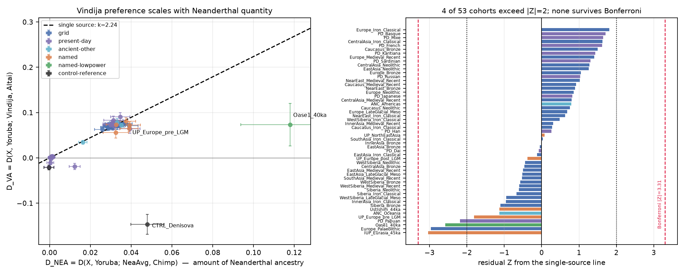
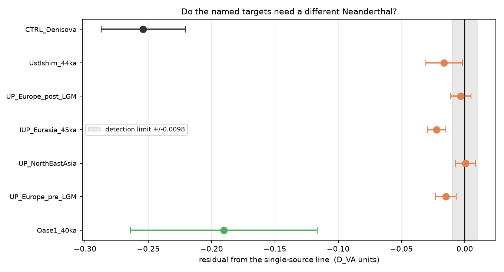
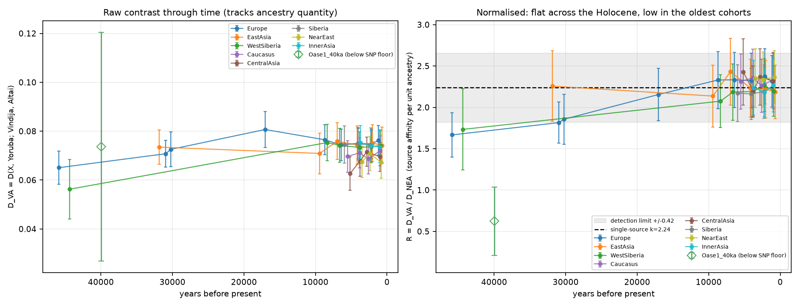
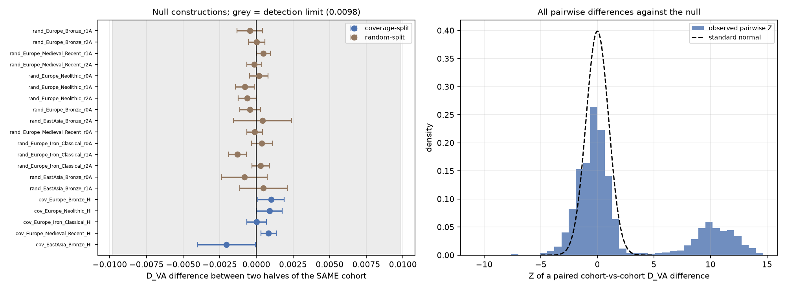

# Which Neanderthal? Altai-versus-Vindija affinity across the ancient Eurasian record

*AADR v66.p1 1240k panel. 10,954 unique Eurasian ancient genomes above a 100,000-SNP floor, pooled into 41 dated cohorts, plus 18 present-day anchors. Paired 50-block jackknife throughout.*

## Abstract

Whether every Eurasian lineage descends from one Neanderthal source population is normally addressed with a handful of genomes. Here the contrast D(X, Yoruba; Vindija, Altai) - positive when a population is closer to the Croatian Vindija Neanderthal than to the Siberian Altai one - is measured across the ancient Eurasian record. Two anchors establish that the instrument works. Every Neanderthal-carrying cohort is displaced towards Vindija (present-day French +0.0747, Han +0.0756), reproducing the result that Vindija sits closer to the introgressing population (Prufer et al. 2017); and with the Denisovan genome as the test population the statistic returns -0.1467 (Z = -6.7), recovering the pull towards Altai expected from that genome's ~1% Denisovan-related ancestry - a real, published difference between the two Neanderthal genomes' own histories.

On the question asked, the answer is a null with a stated limit. Upper Palaeolithic Europeans and Palaeolithic north-east Asians differ by -0.00094 +/- 0.00601 (Z = -0.16) in raw D_VA, and present-day French and Han by -0.00083 +/- 0.00563 (Z = -0.15). A single proportional relation D_VA = 2.24 x D_NEA (+/- 0.31), where D_NEA is a Vindija/Altai-symmetric measure of how much Neanderthal ancestry a cohort has, describes 49 of 53 cohorts within two standard errors, and 0 depart from it after correction for multiple testing. The detection limit is **0.0098 in D_VA units for a typical pair of cohorts, 13% of the total Vindija-over-Altai signal** (0.0015, 2%, for the best-powered pairs). Sources differing by less than that are invisible here, which includes most of what the literature debates about a second pulse into East Asia.

One pattern is not null and is reported as a candidate rather than a finding. The oldest cohorts sit below the single-source line: normalised source affinity is -0.46 +/- 0.20 (Z = -2.35) lower in pre-LGM Upper Palaeolithic Europeans than in Medieval-to-recent Europeans, and -0.65 +/- 0.19 (Z = -3.40) lower in the ~45,000 BP Initial Upper Palaeolithic group. Three things argue against taking this at face value: it correlates with sample age, which is also a proxy for deamination damage and coverage (rho = -0.35 (p = 0.025, n = 40) against date); it is absent from the one Palaeolithic cohort with high coverage (Palaeolithic north-east Asia, -0.06 +/- 0.27, Z = -0.21 against the same comparator); and the effect is carried by the *denominator*, since the raw D_VA of these cohorts is ordinary and it is their elevated D_NEA that moves the ratio. A transversions-only rerun, immune to deamination, shrinks the effect without removing it while the across-cohort age correlation strengthens, so the pattern is not simply damage either. The honest reading is that this study cannot separate a genuinely less Vindija-like early source from an age-linked measurement effect, and it should not be reported as the former.

## The statistic, and the trap inside it

Vindija and Altai are both called at 528,283 autosomal 1240K sites, but only **18,926 of those actually distinguish them** (3.58%). The archaic genomes, not the ancient cohorts, are the limiting sample, and that is why this contrast is hard however many ancient genomes are available. It also has a useful consequence: the same sites carry the signal for every cohort, so their sampling noise is *common-mode* and cancels when two cohorts are differenced inside the same jackknife replicate. Pairing the jackknife this way is 1.9x tighter than combining two independent standard errors, which is the difference between a usable detection limit and an uninformative one.

Three further offsets are common-mode, and are therefore differenced away rather than interpreted:

1. **Vindija is pseudo-haploid (`.SG`) and Altai is diploid (`.DG`)** in this release, and Vindija is called at less than half as many sites. The two genomes are not symmetric inputs.

2. **Yoruba is not archaic-free.** All Africans carry a little Neanderthal ancestry from back-migration (Chen et al. 2020), which shows up here as a non-zero baseline: present-day Mbuti read -0.0207 against the Yoruba baseline rather than zero, and chimpanzee reads -0.0845.

3. **The 1240K panel is ascertained in modern humans**, so archaic variation is sampled non-randomly.

None of these can produce a *difference between two Eurasian cohorts*, since every cohort is measured against the same two archaic genomes and the same baseline. Only differences are reported as results.

### Removing the quantity confound

The confound that does *not* cancel is how much Neanderthal ancestry each cohort has, because D_VA scales with it. Each cohort is therefore also measured with `D_NEA = D(X, Yoruba; NeaAvg, Chimp)`, where `NeaAvg` is the mean of the two archaic frequencies. Swapping Vindija for Altai leaves `NeaAvg` unchanged, so `D_NEA` tracks the amount of Neanderthal ancestry without responding to its source. Under a single shared source every cohort satisfies `D_VA = k * D_NEA` with one k, and k estimates the Vindija preference of the source population itself.

It is worth recording how large this confound actually is on this panel, because the literature figure and this panel's own answer disagree. Published estimates put East Asians somewhere around 8-20% above Europeans in Neanderthal ancestry; this repository's f4-ratio on 1240K puts the ratio at about 1.02, and D_NEA here gives 0.0330 for Han against 0.0307 for French. The correction is therefore small for the East Asian comparison specifically - but it is large for the Palaeolithic cohorts and very large for Oase1, which is where it changes the conclusion.

**Scope condition.** The proportional model only describes cohorts whose departure from the Yoruba baseline is dominated by Neanderthal introgression. Cohorts with D_NEA below 0.02 - all the African ones - are excluded from the fit and from the residual test: their departure from Yoruba is dominated by deep African population structure, and R divides by something indistinguishable from zero. They are still reported, and their D_VA values are informative as a baseline. Chimpanzee is scored on D_VA only, since it appears on both sides of D_NEA and is degenerate there by construction.

## Positive controls: the statistic can see a real source difference

**Denisova as the test population.** The Altai Neanderthal carries ~1% Denisovan-related ancestry (Prufer et al. 2014), so the Denisovan genome should be pulled towards Altai. It is: D_VA = -0.1467 +/- 0.0218 (Z = -6.7), strongly negative while every Eurasian cohort is strongly positive, and a residual of -0.254 (Z = -7.7) from the single-source line. A published difference between the two Neanderthal genomes' own histories is recovered at high significance, which is the evidence that a null elsewhere means something.

**Proportionality.** Across cohorts spanning near-zero to ~12% Neanderthal affinity, D_VA is proportional to D_NEA with slope k = 2.2379 +/- 0.3105 (Z = 7.2).




**Figure 1.** Left: every cohort on the D_VA-versus-D_NEA plane with the fitted single-source line. Right: residuals from that line in standard errors. The line is fitted on the region-by-period grid alone, so the named Palaeolithic cohorts, the present-day anchors and the Denisovan control are all scored against a line they did not help define.

## Result 1: the comparisons the question asks

| label                  | kind              |   n_ind |   D_NEA |    D_VA |   residual |   residual_se |   residual_z |
|:-----------------------|:------------------|--------:|--------:|--------:|-----------:|--------------:|-------------:|
| CTRL_Denisova          | control-reference |       1 |  0.048  | -0.1467 |   -0.254   |       0.03311 |        -7.67 |
| IUP_Eurasia_45ka       | named             |      10 |  0.039  |  0.0651 |   -0.0223  |       0.00735 |        -3.03 |
| Europe_Palaeolithic    | grid              |      28 |  0.039  |  0.0708 |   -0.01647 |       0.00556 |        -2.96 |
| Oase1_40ka             | named-lowpower    |       1 |  0.118  |  0.0736 |   -0.19037 |       0.07374 |        -2.58 |
| PD_Papuan              | present-day       |      32 |  0.0393 |  0.0639 |   -0.02411 |       0.01102 |        -2.19 |
| UP_Europe_pre_LGM      | named             |      14 |  0.0391 |  0.0725 |   -0.01495 |       0.00828 |        -1.81 |
| PD_French              | present-day       |      31 |  0.0307 |  0.0747 |    0.00607 |       0.00375 |         1.62 |
| Europe_Medieval_Recent | grid              |    2984 |  0.0329 |  0.0762 |    0.00253 |       0.0018  |         1.4  |
| UstIshim_44ka          | named             |       1 |  0.0325 |  0.0563 |   -0.01636 |       0.01448 |        -1.13 |
| UP_Europe_post_LGM     | named             |       5 |  0.0374 |  0.0807 |   -0.00312 |       0.00814 |        -0.38 |
| PD_Han                 | present-day       |      46 |  0.033  |  0.0756 |    0.00162 |       0.0061  |         0.27 |
| UP_NorthEastAsia       | named             |       8 |  0.0326 |  0.0735 |    0.00061 |       0.0079  |         0.08 |
| EastAsia_Bronze        | grid              |     212 |  0.0333 |  0.0744 |   -0.00022 |       0.00474 |        -0.05 |


**Upper Palaeolithic Europeans versus Palaeolithic north-east Asians.** Raw D_VA differs by -0.00094 +/- 0.00601 (Z = -0.16); normalised source affinity by -0.40 +/- 0.26 (Z = -1.56). The two groups' Neanderthal ancestry is indistinguishable in Vindija-versus-Altai character.

**The East Asian second pulse.** The specific contested claim is that East Asians received Neanderthal ancestry from an additional or different source. Present-day French and Han differ by -0.00083 +/- 0.00563 (Z = -0.15) in raw D_VA and +0.15 +/- 0.27 (Z = +0.55) normalised; Medieval-to-recent Europeans and Bronze Age East Asians differ by +0.00189 +/- 0.00461 (Z = +0.41). This neither supports nor excludes a second pulse. It bounds how different the two sources could be, and the bound - 13% of the total signal - is not tight enough to adjudicate the debate.

**Oase1.** In raw D_VA Oase1 is unremarkable (+0.0736 +/- 0.0468), which is *itself* the surprise: with D_NEA = 0.1180, three times any other cohort and consistent with his ~10% Neanderthal ancestry, the single-source model predicts a D_VA near 0.26. His residual is -0.190 +/- 0.074 (Z = -2.58). This is **not** reported as evidence that his recent Neanderthal ancestor came from a different population. Oase1 is admitted here deliberately below the study's SNP floor, at 0.05x coverage and 25,838 usable sites against ~507,000 for every other cohort; only ~3.6% of those distinguish the two Neanderthals, leaving a few hundred effectively informative sites spread over 50 jackknife blocks. At that density the jackknife is not trustworthy, the first-order approximation D_VA ~ a x D_VA(source) is least accurate at his admixture proportion, and a single pseudo-haploid genome enters the D denominator differently from a pooled cohort. The honest statement is that Oase1 cannot be placed on this axis with the 1240K panel.




**Figure 4.** Named targets' residuals from the single-source line against the detection limit (grey).

## Result 2: an age-correlated pattern, reported as a candidate

The oldest cohorts sit consistently below the single-source line. Normalised source affinity R is -0.46 +/- 0.20 (Z = -2.35) lower in pre-LGM Upper Palaeolithic Europeans than in Medieval-to-recent Europeans, and -0.65 +/- 0.19 (Z = -3.40) lower in the ~45,000 BP Initial Upper Palaeolithic group; Holocene European cohorts from six periods agree with each other to within a few percent. Taken at face value this would say the earliest Eurasians' Neanderthal ancestry was less Vindija-like. Four checks say it should not be taken at face value.

1. **It tracks the assay, not just the calendar.** Across cohorts, R correlates with sample age (rho = -0.35 (p = 0.025, n = 40)), and age is also a proxy for deamination damage (rho = -0.19 (p = 0.24, n = 38)) and coverage (rho = -0.24 (p = 0.14, n = 40)). These covariates cannot be separated in observational ancient-DNA data.

2. **The high-coverage Palaeolithic cohort does not show it.** Palaeolithic north-east Asia - the only Palaeolithic cohort with median coverage above 4x - sits -0.06 +/- 0.27 (Z = -0.21) from the same Medieval comparator, i.e. on the line. If the effect were a property of Palaeolithic *people*, it should appear there too.

3. **The numerator is ordinary; the denominator moves.** These cohorts' raw D_VA is normal (pre-LGM Upper Palaeolithic Europe +0.0725 against +0.0762 for Medieval Europe, a difference of -0.00370 +/- 0.00538). What moves is D_NEA, elevated to 0.0391 from 0.0329. An elevated Neanderthal level in early Upper Palaeolithic Europeans is independently expected (Fu et al. 2016), so part of this is real - but any age-linked inflation of D_NEA would produce exactly the same deficit in R without any change of source.

4. **Multiple testing.** With 53 cohorts scored, the Bonferroni threshold is |Z| = 3.31; these residuals do not reach it.

The transversions-only rerun is the sharpest discriminator available for check 1, and it is reported next.

Repeating the whole analysis on transversions only removes the deamination error class entirely, at the cost of ~80% of the sites. The age-correlated deficit **does not reach significance** there: pre-LGM Upper Palaeolithic Europe minus Medieval Europe in normalised source affinity is -0.37 +/- 0.21 (Z = -1.79), against the full-panel value quoted above. Losing significance here is consistent with either a damage artifact or the loss of power, and does not settle the question. Cutting the other way, the across-cohort correlation between normalised source affinity and sample age is *stronger* on transversions (rho = -0.49, p = 0.00133) than on the full panel, which is not what a pure deamination artifact would do. The two observations together say the pattern is not simply damage, and that this panel cannot say what it is. The headline comparisons remain null: Upper Palaeolithic Europe minus Palaeolithic north-east Asia +0.00147 +/- 0.01099 (Z = +0.13), French minus Han +0.00330 +/- 0.00760 (Z = +0.43). The detection limit widens to 0.0151 (20% of signal), so this is a weaker but independent check rather than a tighter one, and absolute values are not comparable across the two differently-ascertained SNP sets. Full numbers in `ns_*_transversions.csv`.


| covariate       |    rho |      p |   n |
|:----------------|-------:|-------:|----:|
| date_bp         | -0.354 | 0.0252 |  40 |
| median_coverage | -0.24  | 0.1355 |  40 |
| median_damage   | -0.195 | 0.2418 |  38 |
| median_snps     | -0.155 | 0.3391 |  40 |




**Figure 2.** Left: raw D_VA through time by region, which tracks Neanderthal quantity. Right: normalised source affinity, flat across the Holocene and dipping in the oldest cohorts.

## The time axis

Because the AADR supplies dated cohorts rather than only present-day populations, the question can be asked as a time series - the part of this analysis with no published counterpart.

| label                        | kind   |   n_ind |   date_bp | region      |   median_coverage |   median_damage |   D_NEA |   D_VA |   D_VA_se |   D_VA_z |     R |   R_se |   n_snp |
|:-----------------------------|:-------|--------:|----------:|:------------|------------------:|----------------:|--------:|-------:|----------:|---------:|------:|-------:|--------:|
| Caucasus_Neolithic           | grid   |      98 |      5534 | Caucasus    |              2.12 |           0.127 |  0.0302 | 0.0697 |    0.0065 |    10.73 | 2.311 |  0.332 |  507218 |
| Caucasus_Bronze              | grid   |     307 |      3842 | Caucasus    |              2.12 |           0.115 |  0.0302 | 0.0711 |    0.0061 |    11.69 | 2.357 |  0.344 |  507219 |
| Caucasus_Iron_Classical      | grid   |     127 |      2599 | Caucasus    |              2.06 |           0.119 |  0.0304 | 0.0687 |    0.0062 |    11.14 | 2.262 |  0.323 |  507219 |
| Caucasus_Medieval_Recent     | grid   |      36 |       975 | Caucasus    |              2.06 |           0.096 |  0.0308 | 0.072  |    0.0061 |    11.78 | 2.334 |  0.331 |  507219 |
| CentralAsia_Neolithic        | grid   |      35 |      5163 | CentralAsia |              1.68 |           0.186 |  0.0258 | 0.0627 |    0.0069 |     9.13 | 2.428 |  0.399 |  507217 |
| CentralAsia_Bronze           | grid   |      74 |      3760 | CentralAsia |              1.73 |           0.126 |  0.0309 | 0.0678 |    0.0062 |    10.88 | 2.192 |  0.302 |  507201 |
| CentralAsia_Iron_Classical   | grid   |     134 |      2838 | CentralAsia |              1.82 |           0.133 |  0.0302 | 0.0716 |    0.006  |    11.96 | 2.368 |  0.341 |  507218 |
| CentralAsia_Medieval_Recent  | grid   |      43 |      1000 | CentralAsia |              0.9  |           0.092 |  0.03   | 0.0695 |    0.006  |    11.6  | 2.318 |  0.335 |  507219 |
| EastAsia_LateGlacial_Meso    | grid   |      20 |      9417 | EastAsia    |              3.34 |           0.428 |  0.0332 | 0.0709 |    0.0083 |     8.51 | 2.136 |  0.375 |  507218 |
| EastAsia_Neolithic           | grid   |     150 |      6950 | EastAsia    |              1.24 |           0.089 |  0.0312 | 0.0759 |    0.0075 |    10.06 | 2.432 |  0.404 |  507219 |
| EastAsia_Bronze              | grid   |     212 |      4154 | EastAsia    |              1.16 |           0.084 |  0.0333 | 0.0744 |    0.0079 |     9.44 | 2.231 |  0.35  |  507219 |
| EastAsia_Iron_Classical      | grid   |     204 |      2051 | EastAsia    |              1.78 |           0.155 |  0.0338 | 0.0752 |    0.0075 |     9.96 | 2.221 |  0.349 |  507219 |
| EastAsia_Medieval_Recent     | grid   |     111 |       700 | EastAsia    |              1.83 |           0.242 |  0.034  | 0.0742 |    0.0074 |     9.99 | 2.185 |  0.323 |  507219 |
| Europe_Palaeolithic          | grid   |      28 |     30940 | Europe      |              1.01 |           0.337 |  0.039  | 0.0708 |    0.0055 |    12.87 | 1.815 |  0.25  |  507218 |
| Europe_LateGlacial_Meso      | grid   |     145 |      8704 | Europe      |              2.57 |           0.224 |  0.0328 | 0.0765 |    0.0062 |    12.42 | 2.331 |  0.346 |  507219 |
| Europe_Neolithic             | grid   |    1462 |      6427 | Europe      |              1.64 |           0.116 |  0.0319 | 0.0744 |    0.0065 |    11.52 | 2.333 |  0.333 |  507219 |
| Europe_Bronze                | grid   |    1432 |      4044 | Europe      |              1.33 |           0.108 |  0.0323 | 0.075  |    0.0061 |    12.24 | 2.324 |  0.33  |  507219 |
| Europe_Iron_Classical        | grid   |    1646 |      2175 | Europe      |              1.62 |           0.116 |  0.0315 | 0.0748 |    0.0061 |    12.34 | 2.375 |  0.335 |  507219 |
| Europe_Medieval_Recent       | grid   |    2984 |      1175 | Europe      |              1.7  |           0.154 |  0.0329 | 0.0762 |    0.0061 |    12.59 | 2.315 |  0.311 |  507219 |
| InnerAsia_Bronze             | grid   |      59 |      3722 | InnerAsia   |              1.73 |           0.077 |  0.0336 | 0.0753 |    0.0071 |    10.67 | 2.237 |  0.329 |  507190 |
| InnerAsia_Iron_Classical     | grid   |     220 |      2225 | InnerAsia   |              1.49 |           0.061 |  0.0338 | 0.0739 |    0.0062 |    11.83 | 2.183 |  0.299 |  507219 |
| InnerAsia_Medieval_Recent    | grid   |      61 |      1008 | InnerAsia   |              0.87 |           0.037 |  0.0325 | 0.0736 |    0.0066 |    11.22 | 2.266 |  0.32  |  507216 |
| NearEast_Bronze              | grid   |     106 |      3513 | NearEast    |              1.17 |           0.15  |  0.0287 | 0.0675 |    0.0065 |    10.41 | 2.352 |  0.354 |  507214 |
| NearEast_Iron_Classical      | grid   |      29 |      2375 | NearEast    |              0.94 |           0.161 |  0.0303 | 0.0708 |    0.007  |    10.06 | 2.337 |  0.334 |  507208 |
| NearEast_Medieval_Recent     | grid   |      24 |       800 | NearEast    |              0.76 |           0.078 |  0.0284 | 0.0672 |    0.0064 |    10.48 | 2.365 |  0.32  |  507214 |
| Siberia_Neolithic            | grid   |      66 |      5972 | Siberia     |              2.31 |           0.092 |  0.0343 | 0.0745 |    0.0076 |     9.84 | 2.171 |  0.342 |  507214 |
| Siberia_Bronze               | grid   |     145 |      4065 | Siberia     |              2.28 |           0.079 |  0.0346 | 0.0749 |    0.0066 |    11.27 | 2.162 |  0.308 |  507219 |
| Siberia_Iron_Classical       | grid   |     103 |      2270 | Siberia     |              2.34 |           0.069 |  0.0339 | 0.0744 |    0.0069 |    10.72 | 2.192 |  0.324 |  507219 |
| SouthAsia_Iron_Classical     | grid   |      67 |      2243 | SouthAsia   |              1.63 |           0.096 |  0.0315 | 0.0707 |    0.0082 |     8.59 | 2.243 |  0.408 |  507219 |
| SouthAsia_Medieval_Recent    | grid   |      30 |       900 | SouthAsia   |              4.82 |           0.143 |  0.0331 | 0.071  |    0.0072 |     9.81 | 2.142 |  0.347 |  507194 |
| WestSiberia_LateGlacial_Meso | grid   |      37 |      8342 | WestSiberia |              1.39 |           0.331 |  0.0363 | 0.0753 |    0.0075 |    10.08 | 2.075 |  0.318 |  507217 |
| WestSiberia_Neolithic        | grid   |     191 |      6617 | WestSiberia |              2.74 |           0.103 |  0.034  | 0.0742 |    0.0069 |    10.71 | 2.186 |  0.341 |  507219 |
| WestSiberia_Bronze           | grid   |     209 |      3841 | WestSiberia |              1.89 |           0.074 |  0.0335 | 0.0733 |    0.0064 |    11.39 | 2.191 |  0.316 |  507219 |
| WestSiberia_Iron_Classical   | grid   |     102 |      2227 | WestSiberia |              0.9  |           0.085 |  0.0325 | 0.0737 |    0.0065 |    11.32 | 2.267 |  0.319 |  507219 |
| WestSiberia_Medieval_Recent  | grid   |     129 |       950 | WestSiberia |              2.2  |           0.077 |  0.0337 | 0.0741 |    0.0064 |    11.54 | 2.196 |  0.304 |  507219 |
## Characterising the null

### Null constructions

The floor is measured rather than assumed, by splitting single homogeneous cohorts - which share a Neanderthal source by construction - and differencing the halves. Random splits give the sampling floor. **Coverage-stratified splits give the floor that matters**, because coverage trends with date across the AADR and any coverage-linked bias would masquerade as a temporal signal:

| control        | cohort                 | a                                   | b                                   |   D_VA_diff |   D_VA_diff_se |   D_VA_diff_z |   D_VA_diff_se_independent |   R_diff |   R_diff_se |   R_diff_z |
|:---------------|:-----------------------|:------------------------------------|:------------------------------------|------------:|---------------:|--------------:|---------------------------:|---------:|------------:|-----------:|
| random-split   | Europe_Medieval_Recent | NULLrand_Europe_Medieval_Recent_r0A | NULLrand_Europe_Medieval_Recent_r0B |    -0.00012 |        0.00053 |         -0.23 |                    0.00857 |  -0.0178 |      0.022  |      -0.81 |
| random-split   | Europe_Medieval_Recent | NULLrand_Europe_Medieval_Recent_r1A | NULLrand_Europe_Medieval_Recent_r1B |     0.00048 |        0.00046 |          1.05 |                    0.00857 |   0.0172 |      0.0201 |       0.86 |
| random-split   | Europe_Medieval_Recent | NULLrand_Europe_Medieval_Recent_r2A | NULLrand_Europe_Medieval_Recent_r2B |    -0.00014 |        0.00051 |         -0.27 |                    0.00857 |  -0.0098 |      0.0221 |      -0.44 |
| coverage-split | Europe_Medieval_Recent | NULLcov_Europe_Medieval_Recent_HI   | NULLcov_Europe_Medieval_Recent_LO   |     0.00083 |        0.00051 |          1.62 |                    0.00858 |   0.0643 |      0.0224 |       2.88 |
| random-split   | Europe_Neolithic       | NULLrand_Europe_Neolithic_r0A       | NULLrand_Europe_Neolithic_r0B       |     0.00016 |        0.00063 |          0.26 |                    0.00915 |   0.0547 |      0.0274 |       2    |
| random-split   | Europe_Neolithic       | NULLrand_Europe_Neolithic_r1A       | NULLrand_Europe_Neolithic_r1B       |    -0.00079 |        0.00064 |         -1.23 |                    0.00915 |  -0.031  |      0.0303 |      -1.02 |
| random-split   | Europe_Neolithic       | NULLrand_Europe_Neolithic_r2A       | NULLrand_Europe_Neolithic_r2B       |    -0.00063 |        0.00062 |         -1.03 |                    0.00915 |  -0.0261 |      0.0281 |      -0.93 |
| coverage-split | Europe_Neolithic       | NULLcov_Europe_Neolithic_HI         | NULLcov_Europe_Neolithic_LO         |     0.00089 |        0.00087 |          1.03 |                    0.00924 |  -0.0118 |      0.0365 |      -0.32 |
| random-split   | Europe_Bronze          | NULLrand_Europe_Bronze_r0A          | NULLrand_Europe_Bronze_r0B          |    -0.00043 |        0.0007  |         -0.61 |                    0.00868 |   0.0504 |      0.0328 |       1.54 |
| random-split   | Europe_Bronze          | NULLrand_Europe_Bronze_r1A          | NULLrand_Europe_Bronze_r1B          |    -0.00044 |        0.00087 |         -0.51 |                    0.00869 |   0.0104 |      0.0356 |       0.29 |
| random-split   | Europe_Bronze          | NULLrand_Europe_Bronze_r2A          | NULLrand_Europe_Bronze_r2B          |     1e-05   |        0.00056 |          0.02 |                    0.00867 |  -0.0487 |      0.03   |      -1.62 |
| coverage-split | Europe_Bronze          | NULLcov_Europe_Bronze_HI            | NULLcov_Europe_Bronze_LO            |     0.001   |        0.0009  |          1.12 |                    0.00869 |   0.0828 |      0.0412 |       2.01 |
| random-split   | Europe_Iron_Classical  | NULLrand_Europe_Iron_Classical_r0A  | NULLrand_Europe_Iron_Classical_r0B  |     0.00038 |        0.00071 |          0.53 |                    0.00858 |   0.0009 |      0.0267 |       0.04 |
| random-split   | Europe_Iron_Classical  | NULLrand_Europe_Iron_Classical_r1A  | NULLrand_Europe_Iron_Classical_r1B  |    -0.00129 |        0.00061 |         -2.1  |                    0.00858 |  -0.0288 |      0.0252 |      -1.14 |
| random-split   | Europe_Iron_Classical  | NULLrand_Europe_Iron_Classical_r2A  | NULLrand_Europe_Iron_Classical_r2B  |     0.0003  |        0.00061 |          0.48 |                    0.00858 |   0.0434 |      0.0329 |       1.32 |
| coverage-split | Europe_Iron_Classical  | NULLcov_Europe_Iron_Classical_HI    | NULLcov_Europe_Iron_Classical_LO    |     1e-05   |        0.00067 |          0.01 |                    0.00862 |  -0.0133 |      0.0242 |      -0.55 |
| random-split   | EastAsia_Bronze        | NULLrand_EastAsia_Bronze_r0A        | NULLrand_EastAsia_Bronze_r0B        |    -0.00082 |        0.00156 |         -0.52 |                    0.01118 |  -0.0675 |      0.0655 |      -1.03 |
| random-split   | EastAsia_Bronze        | NULLrand_EastAsia_Bronze_r1A        | NULLrand_EastAsia_Bronze_r1B        |     0.00048 |        0.00162 |          0.3  |                    0.01121 |  -0.0048 |      0.0775 |      -0.06 |
| random-split   | EastAsia_Bronze        | NULLrand_EastAsia_Bronze_r2A        | NULLrand_EastAsia_Bronze_r2B        |     0.00041 |        0.00198 |          0.21 |                    0.01122 |   0.03   |      0.0854 |       0.35 |
| coverage-split | EastAsia_Bronze        | NULLcov_EastAsia_Bronze_HI          | NULLcov_EastAsia_Bronze_LO          |    -0.00205 |        0.00199 |         -1.03 |                    0.01124 |  -0.0769 |      0.0816 |      -0.94 |


The largest absolute null difference in D_VA is 0.00205 and the spread of null differences gives a systematic floor of 0.00153. On the normalised statistic the same splits are noisier - coverage-split R differences reach 0.083 - which is a direct measurement of how much coverage alone can move R, and is the reason the age-correlated pattern above is reported as a candidate.

Note that a same-cohort split is the right yardstick for *bias* and the wrong one for *power*: two halves of one cohort share almost all their ancestry, so their difference has a much smaller standard error than a comparison between genuinely different populations. The statistical floor is therefore taken from the 1378 real cohort-versus-cohort comparisons (0.00983 at the median), not from the splits.




**Figure 3.** Left: null constructions against the detection limit. Right: the distribution of all pairwise cohort-difference Z scores against a standard normal - a check that the paired jackknife is calibrated rather than merely tight.

### Stated detection limit

> **A difference of 0.0098 in D_VA between two typical cohorts is resolvable at 2 sigma; against a typical cohort's D_VA of 0.0737 that is 13%. For the best-powered pairs the limit falls to 0.0015, 2%.**

Concretely: if a cohort replaced a fraction *f* of its Neanderthal ancestry with ancestry from a Neanderthal lineage equidistant between Vindija and Altai, this study would detect it only for *f* > 13% in a typical comparison. Structure within the introgressing population finer than that is invisible here. The corresponding limit on R is 0.42.

This is a statement about the panel, not about history. The limit is set by the 18,926 1240K sites that separate the two archaic genomes; shotgun data at all sites, or the addition of Chagyrskaya and Mezmaiskaya (absent from the AADR), would tighten it substantially.

### Coverage matching

Every core cohort was recomputed on the 1,133,465 SNPs covered in all of them. The fitted slope is 2.2782 +/- 0.3176 against 2.2379 +/- 0.3105 on the full panel, so the shared-SNP restriction changes nothing material. Full numbers in `ns_coverage_matched.csv`.

## Limitations

- **The panel caps the question.** The AADR 1240K release contains three archaic genomes (Altai, Vindija, Denisova) and no Chagyrskaya or Mezmaiskaya, so 'which Neanderthal' can be asked along one axis only, and that axis is defined by two genomes that are themselves close relatives.

- **D_VA and D_NEA are relative affinities, not percentages**, and R is a ratio of two of them, interpretable only across cohorts.

- **The proportional model is first-order.** D_VA ~ a x D_VA(source) neglects terms in the admixture fraction that are acceptable at a ~2% and marginal at Oase1's ~10%.

- **Cohorts are not random samples.** Pooled cohorts mix sites, periods and degrees of relatedness, and no kinship pruning was applied at this scale, so a large cemetery can be over-represented within its cohort.

- **Denisovan ancestry perturbs the contrast.** Because the Altai genome carries Denisovan-related ancestry, populations with Denisovan ancestry of their own are pulled towards Altai for reasons unrelated to their Neanderthal source. Present-day Papuans sit -0.0241 (Z = -2.19) from the line, in the predicted direction; Oceanian cohorts should be read with that in mind.

- **The age-correlated residual is unresolved**, as set out above.

## Reproduce

```bash
python neanderthal_source.py --panel 1240k
python neanderthal_source.py --panel 1240k --transversions
```


*Refs: Green et al. 2010 Science 328:710; Reich et al. 2010 Nature 468:1053; Patterson et al. 2012 Genetics 192:1065; Prufer et al. 2014 Nature 505:43; Fu et al. 2015 Nature 524:216 (Oase1); Fu et al. 2016 Nature 534:200; Prufer et al. 2017 Science 358:655 (Vindija); Chen et al. 2020 Cell 180:677; Mallick et al. 2024 Sci. Data 11:182 (AADR).*


## Full cohort tables

### Named Palaeolithic cohorts and reference controls

| label              | kind              |   n_ind |   date_bp | region      |   median_coverage |   median_damage |   D_NEA |    D_VA |   D_VA_se |   D_VA_z |       R |    R_se |   n_snp |
|:-------------------|:------------------|--------:|----------:|:------------|------------------:|----------------:|--------:|--------:|----------:|---------:|--------:|--------:|--------:|
| CTRL_Chimp         | control-reference |       1 |       nan |             |            nan    |         nan     | -1      | -0.0845 |    0.0112 |    -7.57 | nan     | nan     |  507219 |
| CTRL_Denisova      | control-reference |       1 |       nan |             |            nan    |         nan     |  0.048  | -0.1467 |    0.0218 |    -6.73 |  -3.058 |   0.566 |  258424 |
| CTRL_Mbuti         | control-reference |      15 |       nan |             |            nan    |         nan     | -0.0004 | -0.0212 |    0.0051 |    -4.13 | nan     | nan     |  505844 |
| IUP_Eurasia_45ka   | named             |      10 |     45875 | Europe      |              1.08 |           0.53  |  0.039  |  0.0651 |    0.0068 |     9.54 |   1.667 |   0.267 |  507218 |
| UP_Europe_post_LGM | named             |       5 |     17045 | Europe      |              1.63 |           0.128 |  0.0374 |  0.0807 |    0.0074 |    10.87 |   2.155 |   0.319 |  500298 |
| UP_Europe_pre_LGM  | named             |      14 |     30246 | Europe      |              1    |           0.259 |  0.0391 |  0.0725 |    0.0071 |    10.17 |   1.856 |   0.301 |  507203 |
| UP_NorthEastAsia   | named             |       8 |     31850 | EastAsia    |              4.36 |         nan     |  0.0326 |  0.0735 |    0.0071 |    10.41 |   2.257 |   0.425 |  507215 |
| UstIshim_44ka      | named             |       1 |     44366 | WestSiberia |             40.66 |         nan     |  0.0325 |  0.0563 |    0.0122 |     4.6  |   1.734 |   0.491 |  507183 |
| Oase1_40ka         | named-lowpower    |       1 |     39982 | Europe      |              0.05 |         nan     |  0.118  |  0.0736 |    0.0468 |     1.57 |   0.624 |   0.413 |   25838 |

### Present-day anchors

| label        | kind        |   n_ind |   date_bp | region      |   median_coverage |   median_damage |   D_NEA |    D_VA |   D_VA_se |   D_VA_z |       R |    R_se |   n_snp |
|:-------------|:------------|--------:|----------:|:------------|------------------:|----------------:|--------:|--------:|----------:|---------:|--------:|--------:|--------:|
| PD_Basque    | present-day |      25 |         0 | Europe      |             37.3  |             nan |  0.0302 |  0.0755 |    0.0066 |    11.38 |   2.497 |   0.375 |  505846 |
| PD_Biaka     | present-day |      24 |         0 | Africa      |             41    |             nan |  0.0003 | -0.0105 |    0.0045 |    -2.33 | nan     | nan     |  505824 |
| PD_Dai       | present-day |      14 |         0 | SEAsia      |             36.59 |             nan |  0.0317 |  0.0703 |    0.0084 |     8.41 |   2.221 |   0.403 |  507216 |
| PD_Esan      | present-day |     101 |         0 | Africa      |             35.44 |             nan |  0.0006 | -0.0014 |    0.0015 |    -0.89 | nan     | nan     |  506336 |
| PD_French    | present-day |      31 |         0 | Europe      |             40.07 |             nan |  0.0307 |  0.0747 |    0.0064 |    11.69 |   2.436 |   0.356 |  505851 |
| PD_Gambian   | present-day |     114 |         0 | Africa      |             36.31 |             nan |  0.0017 |  0.0024 |    0.0018 |     1.33 | nan     | nan     |  506338 |
| PD_Han       | present-day |      46 |         0 | EastAsia    |             38.11 |             nan |  0.033  |  0.0756 |    0.008  |     9.47 |   2.287 |   0.376 |  505846 |
| PD_Japanese  | present-day |      31 |         0 | EastAsia    |             45.18 |             nan |  0.0313 |  0.0751 |    0.008  |     9.44 |   2.398 |   0.389 |  506357 |
| PD_Juhoan    | present-day |      10 |         0 | Africa      |             35.64 |             nan |  0.0123 | -0.0188 |    0.007  |    -2.71 | nan     | nan     |  505846 |
| PD_Karitiana | present-day |      15 |         0 | Americas    |             35.76 |             nan |  0.0347 |  0.091  |    0.0086 |    10.53 |   2.622 |   0.463 |  505839 |
| PD_Luhya     | present-day |     103 |         0 | Africa      |             34.43 |             nan |  0.001  |  0.0035 |    0.0028 |     1.25 | nan     | nan     |  507181 |
| PD_Mandenka  | present-day |      26 |         0 | Africa      |             33.93 |             nan |  0.0014 |  0.0039 |    0.0031 |     1.28 | nan     | nan     |  507213 |
| PD_Mbuti     | present-day |      17 |         0 | Africa      |             36.02 |             nan | -0.0003 | -0.0207 |    0.0052 |    -4.01 | nan     | nan     |  505844 |
| PD_Mende     | present-day |      87 |         0 | Africa      |             36.25 |             nan |  0.0001 |  0.0005 |    0.0018 |     0.25 | nan     | nan     |  506337 |
| PD_Mixe      | present-day |       3 |         0 | Americas    |             42.23 |             nan |  0.0312 |  0.0835 |    0.0091 |     9.19 |   2.674 |   0.485 |  495853 |
| PD_Papuan    | present-day |      32 |         0 | Oceania     |             40.42 |             nan |  0.0393 |  0.0639 |    0.0095 |     6.74 |   1.625 |   0.318 |  505851 |
| PD_Russian   | present-day |      27 |         0 | WestSiberia |             35.4  |             nan |  0.0322 |  0.0756 |    0.0058 |    12.97 |   2.348 |   0.322 |  505849 |
| PD_Sardinian | present-day |      31 |         0 | Europe      |             33.49 |             nan |  0.0299 |  0.0724 |    0.0073 |     9.91 |   2.419 |   0.376 |  505853 |