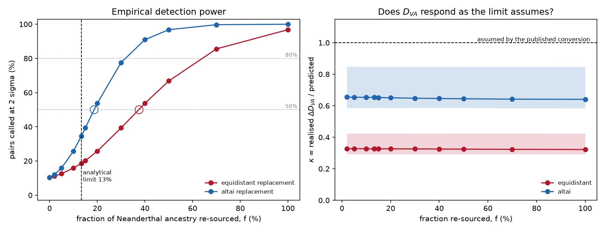

# Is the 13% limit calibrated? Simulated mixtures at known fractions

*Companion to `PAPER_neanderthal_source.md` and `POWER_two_way_subsample.md`. AADR v66.p1 1240K panel, 35 testable grid cohorts, 595 pairs, 500 paired block-bootstrap replicates per pair per fraction.*

## What was actually assumed

The published limit is a conversion: a resolvable D_VA difference of 0.00983, divided by a typical cohort's D_VA of 0.07369, gives 13.3%. The division assumes that re-sourcing a fraction *f* of a cohort's Neanderthal ancestry to a lineage equidistant between Vindija and Altai moves its D_VA by exactly *f* x its own D_VA. Nothing in the study tested that. This does.

## Method

Mixtures are built at the allele-frequency level and pushed through the unmodified statistic:

```
p_X'(f) = p_X + alpha_X * f * (p_S' - p_Vindija)
```

with alpha_X the cohort's own f4-ratio Neanderthal fraction, and p_S' either the equidistant lineage (p_V+p_A)/2 - the counterfactual the published sentence names - or a full swap to Altai, the most different source the panel contains. Every SNP's numerator and denominator are recomputed and D_VA is whatever comes out. Shifting D_VA by *f* x D_VA directly would have assumed the conclusion and returned the published number by construction.

Detection is measured by a paired block bootstrap: the 50 jackknife blocks are resampled with replacement, identically for both cohorts, and within each replicate the difference **and its jackknife standard error** are both recomputed, so the simulated analyst tests with the error bar they would really have had.

## Result 1: does D_VA respond as assumed?

|                        |   median |    min |    max |
|:-----------------------|---------:|-------:|-------:|
| ('altai', 0.02)        |   0.6547 | 0.5859 | 0.8479 |
| ('altai', 0.05)        |   0.6542 | 0.586  | 0.8479 |
| ('altai', 0.1)         |   0.6531 | 0.586  | 0.8478 |
| ('altai', 0.133)       |   0.6529 | 0.586  | 0.8478 |
| ('altai', 0.15)        |   0.6523 | 0.586  | 0.8478 |
| ('altai', 0.2)         |   0.6505 | 0.586  | 0.8477 |
| ('altai', 0.3)         |   0.6479 | 0.5861 | 0.8476 |
| ('altai', 0.4)         |   0.646  | 0.5862 | 0.8475 |
| ('altai', 0.5)         |   0.6444 | 0.5861 | 0.8474 |
| ('altai', 0.7)         |   0.6418 | 0.5853 | 0.8472 |
| ('altai', 1.0)         |   0.6406 | 0.5839 | 0.8469 |
| ('equidistant', 0.02)  |   0.3274 | 0.293  | 0.424  |
| ('equidistant', 0.05)  |   0.3274 | 0.293  | 0.4239 |
| ('equidistant', 0.1)   |   0.3271 | 0.293  | 0.4239 |
| ('equidistant', 0.133) |   0.3266 | 0.293  | 0.4239 |
| ('equidistant', 0.15)  |   0.3266 | 0.293  | 0.4239 |
| ('equidistant', 0.2)   |   0.3266 | 0.293  | 0.4239 |
| ('equidistant', 0.3)   |   0.3261 | 0.293  | 0.4239 |
| ('equidistant', 0.4)   |   0.3252 | 0.293  | 0.4239 |
| ('equidistant', 0.5)   |   0.3245 | 0.293  | 0.4238 |
| ('equidistant', 0.7)   |   0.3234 | 0.2931 | 0.4238 |
| ('equidistant', 1.0)   |   0.3222 | 0.2931 | 0.4237 |


For the equidistant replacement kappa = 0.327: a mixture of fraction *f* moves D_VA by 0.327 x *f* x D_VA, not 1.000 x. The published conversion is therefore off by that factor, and the threshold it implies is 40.8% rather than 13.3%.

kappa is flat in *f* across the whole range, so the response is linear - it is the *slope* that is wrong, not the linearity. The Altai-swap row is about twice the equidistant row because a full swap is twice the frequency displacement of a half-way one; only the equidistant row is expected to give kappa = 1, since only it is the counterfactual the published sentence names.

### Why kappa is not 1

The conversion needs D_VA(X) = alpha x D_VA(source). Inverting that on this data asks the source population to have a D-statistic of 2.58 to 3.97. **A D-statistic cannot exceed 1.** The relation is therefore not approximately wrong, it is impossible, and no simulation is needed to see it.

The reason is one the study already states and then does not apply here. `PAPER_neanderthal_source.md` says D_VA's *absolute* value is not interpretable - Vindija is pseudo-haploid where Altai is diploid, Vindija is called at less than half as many sites, and Yoruba carries its own Neanderthal ancestry - and that only differences between cohorts are meaningful, because those offsets are common-mode and cancel. The detection limit is the one place in the study that divides by the absolute value. Those offsets inflate the denominator of that division without contributing anything a real mixture can move, so the limit comes out too small by roughly the inflation factor.

## Result 2: empirical detection power

| replacement   |   fraction |   n_pairs |   detect_rate |   median_abs_diff |   median_abs_z |   median_se_jackknife |   median_se_bootstrap |   se_ratio_boot_over_jack |
|:--------------|-----------:|----------:|--------------:|------------------:|---------------:|----------------------:|----------------------:|--------------------------:|
| equidistant   |      0     |       595 |       0.10448 |           0.00297 |        0.73352 |               0.00364 |               0.00363 |                   0.99001 |
| equidistant   |      0.02  |       595 |       0.11149 |           0.00306 |        0.73365 |               0.00364 |               0.00363 |                   0.99    |
| equidistant   |      0.05  |       595 |       0.12555 |           0.00311 |        0.83468 |               0.00364 |               0.00363 |                   0.99001 |
| equidistant   |      0.1   |       595 |       0.15866 |           0.00365 |        0.96811 |               0.00364 |               0.00363 |                   0.98992 |
| equidistant   |      0.133 |       595 |       0.1854  |           0.00419 |        1.14826 |               0.00364 |               0.00363 |                   0.99009 |
| equidistant   |      0.15  |       595 |       0.20161 |           0.00453 |        1.24791 |               0.00364 |               0.00363 |                   0.9901  |
| equidistant   |      0.2   |       595 |       0.25731 |           0.00552 |        1.52615 |               0.00364 |               0.00363 |                   0.99037 |
| equidistant   |      0.3   |       595 |       0.39343 |           0.00804 |        2.16875 |               0.00364 |               0.00364 |                   0.99044 |
| equidistant   |      0.4   |       595 |       0.53739 |           0.01048 |        2.85242 |               0.00364 |               0.00364 |                   0.99038 |
| equidistant   |      0.5   |       595 |       0.66802 |           0.01288 |        3.46387 |               0.00364 |               0.00365 |                   0.99041 |
| equidistant   |      0.7   |       595 |       0.85555 |           0.01773 |        4.73281 |               0.00364 |               0.00366 |                   0.99006 |
| equidistant   |      1     |       595 |       0.96792 |           0.02471 |        6.61342 |               0.00364 |               0.00366 |                   0.98951 |
| altai         |      0     |       595 |       0.10448 |           0.00297 |        0.73352 |               0.00364 |               0.00363 |                   0.99001 |
| altai         |      0.02  |       595 |       0.1204  |           0.00311 |        0.80278 |               0.00364 |               0.00363 |                   0.99    |
| altai         |      0.05  |       595 |       0.15866 |           0.00365 |        0.96811 |               0.00364 |               0.00363 |                   0.98992 |
| altai         |      0.1   |       595 |       0.25731 |           0.00552 |        1.52615 |               0.00364 |               0.00363 |                   0.99037 |
| altai         |      0.133 |       595 |       0.3446  |           0.00716 |        1.94821 |               0.00364 |               0.00363 |                   0.99053 |
| altai         |      0.15  |       595 |       0.39343 |           0.00804 |        2.16875 |               0.00364 |               0.00364 |                   0.99044 |
| altai         |      0.2   |       595 |       0.53739 |           0.01048 |        2.85242 |               0.00364 |               0.00364 |                   0.99038 |
| altai         |      0.3   |       595 |       0.77564 |           0.01532 |        4.10267 |               0.00364 |               0.00365 |                   0.9905  |
| altai         |      0.4   |       595 |       0.90949 |           0.02011 |        5.43029 |               0.00364 |               0.00367 |                   0.98982 |
| altai         |      0.5   |       595 |       0.96792 |           0.02471 |        6.61342 |               0.00364 |               0.00366 |                   0.98951 |
| altai         |      0.7   |       595 |       0.99712 |           0.03384 |        9.13843 |               0.00365 |               0.00367 |                   0.989   |
| altai         |      1     |       595 |       0.99995 |           0.04738 |       12.8584  |               0.00367 |               0.00368 |                   0.98813 |


**Baseline at f = 0: 10.4% of pairs called, median |Z| = 0.73.** This is not a false-positive rate: real cohorts really do differ a little, so it is the study's own pairwise significance rate among these pairs and an upper bound on the nominal 5%. The median |Z| below 1 is the sign that most of these pairs are genuinely null, consistent with the study's finding that none survive Bonferroni. The power rows below include this baseline rather than subtracting it.

**The bootstrap and the jackknife agree on the error bar** (SE_boot/SE_jack = 0.990 at the median). That is the calibration check that licenses the rest of the table: the resampling scheme used to simulate detection and the jackknife used to size the error bar are not telling different stories about this data.

**f50 = 37.4%** against the analytical 13.3%. The two disagree, and the empirical curve is what should be believed: it makes no linearity assumption.

**f80 = 64.1%.** This is the number worth quoting to anyone asking what the study would have *found*. A 2-sigma threshold gives about 50% power against an effect sitting exactly on it, so the published limit is the point at which detection becomes a coin flip, not the point at which a real difference would reliably have been seen.




**Figure 6.** Left: detection rate against injected fraction, with the analytical limit marked and f50 ringed. Right: kappa, the realised D_VA response as a fraction of the response the published conversion assumes; the dashed line is the assumption.

## Caveats

- **The result scales inversely with alpha.** The injected shift is alpha x *f* x (target - source), so f50 and f80 move in proportion to whatever error is in the cohort Neanderthal fractions. This repository's f4-ratio is known to run ~0.2pp high on a ~2.1% base, so if alpha is overstated by 10% the true thresholds are 10% *higher* than reported here. No other input carries this sensitivity.

- **The mixture is instantaneous and clean.** One source replaced by another at a known fraction, with no drift, no LD decay and no post-admixture selection. A real second pulse would be messier and harder to see, so these thresholds are optimistic as descriptions of history even where they are exact as descriptions of the statistic.

- **p_Vindija stands in for the true introgressing source**, which is unobserved. Vindija is the closest available proxy (Prufer et al. 2017) and is what the study's premise already assumes; a source further from Vindija would change kappa.

- **This calibrates the conversion, not the floor.** The 0.00983 resolvable difference is taken as given from `ns_detection_limit.csv`; what is tested here is the step from that number to a percentage of ancestry.
