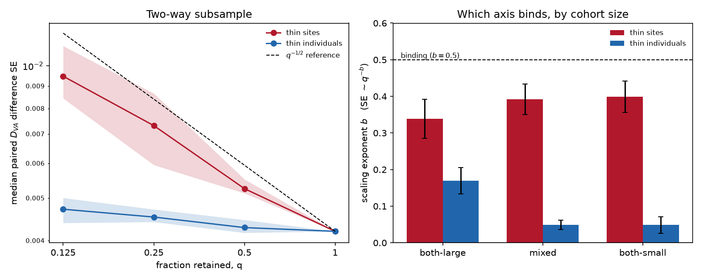

# Which sample is limiting? A two-way subsample of the Vindija-vs-Altai contrast

*Companion to `PAPER_neanderthal_source.md`. AADR v66.p1 1240K panel, 6 grid cohorts, 15 pairs, 4 replicates per thinning level, paired 50-block jackknife throughout.*

## Why

The main report states a detection limit of 0.0098 in D_VA units (13% of the total Vindija-over-Altai signal) and attributes it to the archaic genomes: *'The archaic genomes, not the ancient cohorts, are the limiting sample.'* That attribution was an assertion, supported only by the observation that just 17,824 of 507,219 usable sites separate Vindija from Altai. A small informative-site count makes the claim plausible; it does not establish it, because the cohort allele frequencies carry sampling noise of their own and the two terms enter the same variance.

## The test

Two arms, read out on the exact quantity that sets the published limit - the standard error of a paired block-jackknife D_VA difference between two cohorts:

- **Arm A** keeps a random fraction *q* of the sites where both archaics are called, holding cohort membership fixed.
- **Arm B** keeps a random fraction *q* of each cohort's genomes, holding the SNP set fixed.

Fitting log(SE) on log(*q*) gives *b* in SE ~ *q*^-*b*. An axis that binds returns *b* ~ 0.5 (halving it costs the usual sqrt(2)); an axis that has saturated returns *b* ~ 0.

## Result

| arm         | pair_class   |      b |   b_se |   n_points |   se_at_1 |   se_at_min |   ratio_min_to_1 |   var_share |   var_axis |   var_floor |
|:------------|:-------------|-------:|-------:|-----------:|----------:|------------:|-----------------:|------------:|-----------:|------------:|
| sites       | all          | 0.4081 | 0.0462 |         13 |    0.0042 |      0.0095 |           2.2562 |      0.5397 |          0 |           0 |
| sites       | both-large   | 0.3384 | 0.0533 |         13 |    0.0014 |      0.0028 |           2.0936 |      0.4367 |          0 |           0 |
| sites       | both-small   | 0.3993 | 0.0431 |         13 |    0.0044 |      0.01   |           2.2607 |      0.464  |          0 |           0 |
| sites       | mixed        | 0.3918 | 0.0415 |         13 |    0.0046 |      0.0101 |           2.1939 |      0.5278 |          0 |           0 |
| individuals | all          | 0.0626 | 0.0182 |         13 |    0.0042 |      0.0047 |           1.1229 |      0.0361 |          0 |           0 |
| individuals | both-large   | 0.1693 | 0.0356 |         13 |    0.0014 |      0.0019 |           1.3735 |      0.1617 |          0 |           0 |
| individuals | both-small   | 0.0485 | 0.0225 |         13 |    0.0044 |      0.0049 |           1.1034 |      0.0246 |          0 |           0 |
| individuals | mixed        | 0.0488 | 0.013  |         13 |    0.0046 |      0.0051 |           1.099  |      0.03   |          0 |           0 |

Over all 15 pairs, thinning **sites** gives *b* = 0.408 +/- 0.046 and thinning **individuals** gives *b* = 0.063 +/- 0.018. Cutting the panel to 0.125 of its sites multiplies the median paired SE by 2.26; cutting every cohort to 0.125 of its genomes multiplies it by 1.12.

### The curve

|                        |   se_median |   se_both-large |   se_both-small |   n_informative |   median_n_ind |
|:-----------------------|------------:|----------------:|----------------:|----------------:|---------------:|
| ('individuals', 0.125) |     0.00472 |         0.00186 |         0.00491 |        17824    |          102.5 |
| ('individuals', 0.25)  |     0.00453 |         0.00142 |         0.00486 |        17824    |          205.5 |
| ('individuals', 0.5)   |     0.00428 |         0.0014  |         0.00459 |        17824    |          411   |
| ('individuals', 1.0)   |     0.0042  |         0.00135 |         0.00445 |        17824    |          822   |
| ('sites', 0.125)       |     0.00947 |         0.00283 |         0.01005 |         2218.75 |          822   |
| ('sites', 0.25)        |     0.00731 |         0.00206 |         0.00802 |         4475.25 |          822   |
| ('sites', 0.5)         |     0.00525 |         0.00176 |         0.00574 |         8925.5  |          822   |
| ('sites', 1.0)         |     0.0042  |         0.00135 |         0.00445 |        17824    |          822   |

**Figure 5.** Left: median paired D_VA difference SE against the fraction retained, both arms, with the *q*^-1/2 reference. Shading spans the replicates. Right: the fitted exponent by pair class.

## What this does and does not license

**The site axis binds and the genome axis does not.** Thinning sites returns an exponent 7x the one from thinning genomes, and the two intervals are far apart. Discarding 88% of the ancient genomes in every cohort costs 12% on the median paired SE; discarding 88% of the sites costs 126%. The paper's sentence is supported.

**The site exponent is near, but a little below, the square-root law.** 0.41 +/- 0.05 against the 0.5 an independent-sites model predicts. Linkage is the expected reason - neighbouring sites carry partly redundant information, so removing half of them removes less than half the information - but the replicate scatter here is wide enough that 0.5 is not excluded, and this script is not powered to separate those. Nothing in the conclusion depends on which it is.

**Read-across to the published limit is approximate.** These 15 probe pairs are all reasonably-powered grid cohorts and give a full-data median paired SE of 0.00420, against the 0.00491 median over the 1,378 real comparisons that set the published floor - the published set includes small and low-coverage cohorts these six do not represent. The exponents are the transferable result; the absolute SEs are not.

**How much of the current error bar each axis holds.** Thinning by *q* multiplies the thinned axis's variance by 1/*q* and leaves the rest alone, so fitting SE^2 against 1/*q* splits the full-data variance into an axis-driven part and a part that axis cannot touch. Sites hold at least 54% of the full-data paired variance; genomes hold 4%. That is the quantitative form of the claim, and the one worth quoting: an infinite number of ancient Eurasian genomes, with this archaic panel, would remove about 4% of the variance behind the 13% limit.

The two shares do not sum to 100%, and the remainder is **not** a third source of error. The 1/*q* model assumes independent sites; the measured site exponent is 0.41 rather than 0.5, so site variance actually grows as *q*^-0.82, slower than the 1/*q* the fit imposes, and the shortfall is absorbed into the floor term. The site share is therefore a lower bound and the true split is more lopsided than 54/4. The genome share is not affected by this: its exponent is near zero, which is a well-behaved place for the same fit to sit.

**One asymmetry that is real but does not bite.** The genome axis is least flat for the both-large pairs (*b* = 0.169 +/- 0.036, holding 16% of their variance) and flattest for the both-small pairs (*b* = 0.048 +/- 0.023, 2%), which is the reverse of what diminishing returns in cohort size would predict. The likely reason is that the three both-large cohorts are successive periods of the same European population and so their per-block deviations are strongly correlated; the pairing cancels most of what they share, and what survives is a small SE (0.00135 against 0.00445) in which the independent per-cohort sampling term is a larger *share*. Note the corollary: the cross-sectional fact that large-cohort pairs have smaller SEs than small-cohort pairs is **not** evidence that cohort size drives the SE, because it confounds size with how closely related the two cohorts are. Only the within-cohort thinning separates them, which is the reason for running it this way.

**What would actually move the limit.** Since sites bind, the leverage is entirely on the archaic side: shotgun data at all sites rather than the 1240K ascertainment, or additional Neanderthal genomes (Chagyrskaya, Mezmaiskaya) that are absent from this AADR release. Adding ancient Eurasian genomes - the axis the AADR grows along - is the one thing that will not help.
