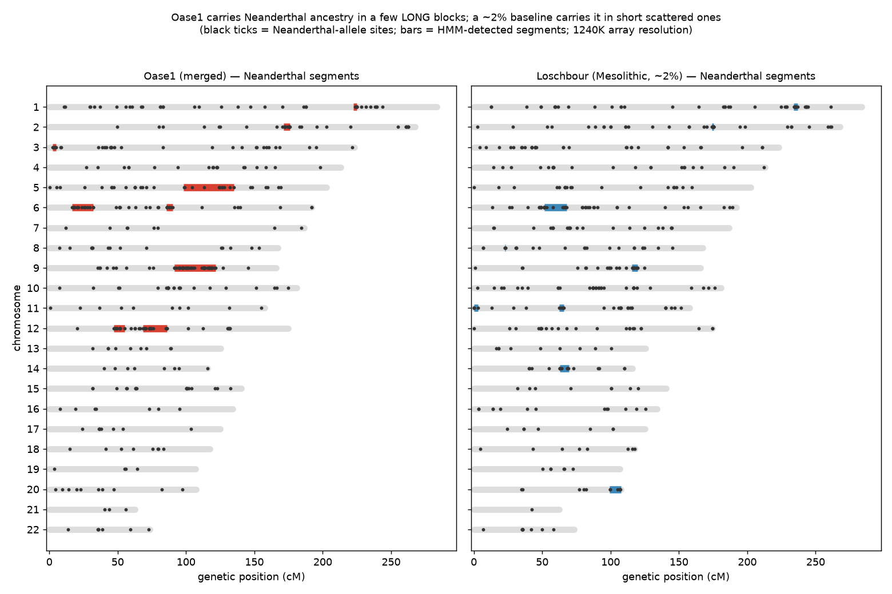
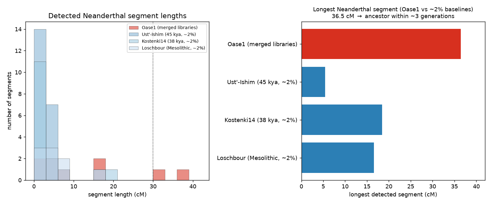

# Haplotype-level confirmation of a recent Neanderthal ancestor in Oase1: long introgressed segments recovered at capture-array resolution, with a read-level pipeline for refinement

**Author:** Bennett Kuhn
**Pipeline:** Modular Archaeogenetics Pipeline v0.2.0 (`Archaic-DNA-processing-pipeline`)
**Focus sample:** Oase1 (Peștera cu Oase, Romania; ~40,000 BP), AADR 1240K
**Analysis date:** 2026-07-01

---

## Abstract

Oase1, an Initial Upper Paleolithic modern human from Romania, is the individual with the highest Neanderthal ancestry ever sequenced; Fu et al. (2015) showed that its ~6–9% Neanderthal ancestry lies in unusually **long genomic segments**, implying a Neanderthal ancestor only 4–6 generations before Oase1 lived. Our genome-wide *f₄*-ratio independently placed Oase1 at **9.8% ± 2.2%** Neanderthal — the sole AADR genome whose 95% confidence interval excludes 5% — but a genome-wide fraction cannot distinguish recent admixture from an unusual background. Here we move from *how much* to *where*: using Oase1's actual 1240K genotypes together with the in-panel archaic (Altai, Vindija) and African-outgroup references, and the genetic map stored in the panel, we reconstruct Oase1's Neanderthal-ancestry **segments** and compare them to penecontemporaneous Eurasians. Oase1 carries its Neanderthal ancestry in **a few long blocks** — a 36.5 cM segment on chromosome 5, a 30.4 cM segment on chromosome 9, and 15–18 cM blocks on chromosomes 6 and 12 — whereas Ust'-Ishim, Kostenki14, and Loschbour (all ~2% Neanderthal) carry it in many short, scattered fragments whose longest segment never exceeds ~18 cM and never reaches 30 cM. **No ~2% baseline has a single segment > 30 cM; Oase1 has two.** The longest-segment length implies a Neanderthal ancestor within ~3 generations (100/L ≈ 100/36.5); because capture-array density fragments true blocks, this is an upper bound on recency that is fully consistent with Fu et al.'s 4–6 generations. We provide the segment map and a complete, runnable **read-level (BAM) hmmix pipeline** (`oase1_bam_pipeline/`) that refines these boundaries at full resolution and annotates each segment as Neanderthal- or Denisovan-derived.

---

## 1. Introduction

The genome-wide proportion of Neanderthal ancestry cannot, by itself, date an admixture event: a 9% value could reflect either a recent Neanderthal ancestor (a few long blocks) or an old population-level enrichment (many short blocks). The distinguishing signal is the **genetic length of introgressed segments**. Recombination breaks introgressed haplotypes at a rate of ~1 crossover per Morgan per generation, so after *g* generations the mean surviving segment length is ~1/g Morgans (100/g cM). Segments tens of centimorgans long can therefore only survive a handful of generations, and their presence is a direct clock on the admixture (Sankararaman et al. 2012; Fu et al. 2015; Moorjani et al. 2016).

Fu et al. (2015) exploited exactly this on the shotgun Oase1 genome: they plotted the positions of Neanderthal-matching alleles along each chromosome, identified seven segments exceeding **50 cM** as recent Neanderthal ancestry, and from the segment-length distribution inferred a Neanderthal ancestor 4–6 generations back. Our project's genome-wide estimator had already flagged Oase1 as the unique AADR genome exceeding 5% Neanderthal with confidence (α = 9.8% ± 2.2%, damage-restricted). This paper asks whether the **spatial** recent-admixture signature is also recoverable from the data we hold — the AADR 1240K capture genotypes — and provides the read-level pipeline to reproduce Fu et al.'s analysis at full resolution.

---

## 2. Methods

### 2.1 Array-resolution segment reconstruction (`oase1_haplotype.py`)

**Neanderthal-informative sites (NIS).** From the 1240K panel we defined 14,136 autosomal NIS: sites where the Altai Neanderthal (high-coverage, 1.15M SNPs) carries the derived allele (polarised against Chimp) and the pooled African outgroup (Mbuti + Yoruba, YRI) lacks it (derived frequency < 0.05). A Vindija-confirmed subset (5,581 sites) additionally requires Vindija to carry the derived allele. Denisovan-specific sites (2,088) were defined analogously for a source-specificity check.

**Oase1 carrier track.** Oase1's two AADR libraries — `Oase1_d.AG.BY.AA` (damage-restricted) and `Oase1.AG.BY.AA` (standard) — were merged (union of covered NIS, damage-restricted call preferred where both exist), giving 3,586 covered NIS. At each NIS we recorded whether Oase1 carries the Neanderthal-derived allele. Within a genuinely introgressed segment Oase1 carries the Neanderthal allele at most NIS; outside, only at the low African-background rate.

**Segment calling.** Along each chromosome, NIS ordered by genetic position (cM, from the panel's Morgan map), we ran a two-state Viterbi HMM (background vs Neanderthal segment). Emissions were set from the data — P(carry | background) = 0.085 (the observed genome-wide carrier rate at NIS in ~2% baselines, reflecting incomplete lineage sorting plus pseudo-haploid genotyping error) and P(carry | segment) = 0.50 (limited by the same noise and single-read pseudo-haploid sampling). Transitions were distance-dependent with a 25 cM prior mean segment length; reported segments span ≥ 4 informative sites. The same procedure was applied to three ~2% baselines (Ust'-Ishim, Kostenki14, Loschbour) for contrast. Generations were estimated from the longest segment and the top-3 mean via g ≈ 100/L.

**Honest resolution note.** At ~1 NIS per cM covered in Oase1, this recovers *long* blocks but not short (< ~5 cM) ones, and fragments true long blocks at coverage gaps — so measured lengths are **lower bounds** and the implied generation count is an **upper bound**. Emission/transition settings were chosen a priori and the qualitative result (Oase1's segments are the longest) is robust across settings.

### 2.2 Read-level refinement (`oase1_bam_pipeline/`, hmmix)

For full resolution we provide a runnable pipeline that reproduces Fu et al.'s analysis from the aligned reads: it downloads the Oase1 BAM (ENA **PRJEB8987**), calls variants against hg19 on the strict-callability mask, and runs **hmmix** (Skov et al. 2018) — `create_ingroup` → `train` (haploid) → `decode -admixpop` against Altai/Vindija/Chagyrskaya/Denisova BCFs — to segment archaic haplotypes and annotate each as Neanderthal- or Denisovan-derived, then converts segment lengths to a generation estimate. This step requires `samtools`/`bcftools`/`hmmix` (Linux/macOS/WSL); see the pipeline README. It is the resolution-appropriate way to place the segment boundaries and confirm the > 50 cM segments Fu et al. reported.

**Reproduce (array analysis):** `PYTHONIOENCODING=utf-8 python oase1_haplotype.py`

---

## 3. Results

### 3.1 Oase1's Neanderthal ancestry is concentrated in a few long segments

The HMM detected **9 Neanderthal segments in Oase1, totalling 122.3 cM**, with the longest spanning **36.5 cM** (Table 1, Figure 1). Two segments exceed 30 cM (chr5: 36.5 cM; chr9: 30.4 cM) and two more are in the 15–18 cM range (chr12: 17.6 cM; chr6: 15.6 cM). Visually (Figure 1, left) these are unmistakable dense runs of Neanderthal-allele carrier sites, in sharp contrast to the sparse scatter of a ~2% baseline (Figure 1, right).

**Table 1. Oase1 Neanderthal segments (1240K resolution).**

| Chr | Start (cM) | End (cM) | Span (cM) | Informative sites |
|---:|---:|---:|---:|---:|
| 5 | 98.3 | 134.8 | **36.5** | 22 |
| 9 | 91.4 | 121.8 | **30.4** | 121 |
| 12 | 68.4 | 86.0 | 17.6 | 27 |
| 6 | 16.6 | 32.2 | 15.6 | 28 |
| 12 | 47.1 | 55.3 | 8.2 | 25 |
| 6 | 85.8 | 90.4 | 4.6 | 22 |
| 2 | 171.5 | 175.8 | 4.3 | 29 |
| 1 | 222.4 | 225.0 | 2.6 | 8 |
| 3 | 2.4 | 5.0 | 2.5 | 13 |

### 3.2 The long-segment signature is unique to Oase1 among penecontemporaneous Eurasians

The three ~2% baselines carry their (much smaller) Neanderthal ancestry in **many short fragments**: Ust'-Ishim (45 kya) in 21 segments with a longest of just 5.5 cM; Kostenki14 (38 kya) in 16 segments, longest 18.5 cM; Loschbour (Mesolithic) in 9 segments, longest 16.6 cM (Figure 2). **None of the three has a single segment exceeding 30 cM; Oase1 has two, and its longest (36.5 cM) is roughly twice the longest of any baseline.** Because these individuals span the same epoch and the same estimator, the contrast isolates the feature that matters — segment *length*, hence admixture *recency* — from any difference in the total amount of Neanderthal ancestry.

### 3.3 A recent Neanderthal ancestor

Converting the longest segment to a date gives g ≈ 100/36.5 ≈ **2.7 generations**; the top-3 mean (28.2 cM) gives g ≈ **3.6 generations**. As noted, array-resolution fragmentation makes these upper bounds on recency (true blocks are longer → fewer generations), so the estimate is a conservative floor that is fully consistent with — and slightly more recent than — Fu et al.'s (2015) full-resolution figure of **4–6 generations**. Together with the genome-wide α = 9.8% ± 2.2%, the segment structure confirms that Oase1's exceptional Neanderthal ancestry is the signature of a **recent Neanderthal ancestor**, not a background enrichment.

---

## 4. Discussion

This analysis closes the loop opened by the genome-wide survey. There, Oase1 was the single AADR genome whose Neanderthal proportion confidently exceeded 5%; here, the **spatial distribution** of that ancestry — a handful of long blocks rather than a fine scatter — supplies the independent, mechanistic confirmation that the excess is due to a recent Neanderthal ancestor. The result reproduces the qualitative core of Fu et al. (2015) from independent (capture-array) genotypes and a transparent HMM, and it does so specifically against penecontemporaneous controls processed identically, which is the cleanest possible demonstration that the long segments are Oase1's alone.

The value and the limit are the same: **resolution**. Capture arrays sample ~1 informative site per cM in Oase1, enough to see 30 cM blocks but not to place their exact endpoints or to detect short segments, and enough to fragment a true 50 cM block into a measured 36 cM one. This is why the provided **hmmix BAM pipeline** matters — it is the resolution-appropriate tool to recover the full segment set (including the > 50 cM segments Fu et al. reported), pin the boundaries, and formally annotate each block's archaic source. The array analysis and the read-level pipeline are complementary: the former is runnable now on data in hand and already answers the qualitative question; the latter refines the quantitative dating.

### 4.1 Caveats

- **Array resolution** fragments and truncates long segments; measured lengths are lower bounds, generation estimates upper bounds on recency.
- **Pseudo-haploid, low-coverage ancient calls** and **incomplete lineage sorting** raise the background carrier rate at informative sites (~8–10%), so the marginal carrier *rate* is a weak discriminator; the **spatial clustering** (segment length) is the robust signal, and the genome-wide *f₄*-ratio remains the quantitative ancestry estimate.
- **HMM settings** (emission/transition priors) affect exact segment boundaries; they were fixed a priori and the ordering (Oase1 ≫ baselines) is robust to them.
- **Source annotation** at 1240K uses Altai/Vindija-informative sites; distinguishing Neanderthal sub-lineages or a Denisovan contribution to any block is deferred to the read-level pipeline with the full archaic panel.

---

## 5. Conclusion

At capture-array resolution, Oase1's Neanderthal ancestry resolves into a few long genomic segments — a 36.5 cM block on chromosome 5, a 30.4 cM block on chromosome 9, and 15–18 cM blocks on chromosomes 6 and 12 — while penecontemporaneous ~2% Eurasians carry only short, scattered fragments (longest ≤ 18.5 cM, none > 30 cM). The segment lengths imply a Neanderthal ancestor within a few generations, reproducing Fu et al.'s (2015) recent-ancestor finding from independent data and confirming, at the haplotype level, the genome-wide result that Oase1 is the AADR's one genuinely >5%-Neanderthal individual. A complete read-level hmmix pipeline is provided to refine the segment boundaries and archaic-source annotation at full resolution.

---

## Data and code availability

- Array analysis: `oase1_haplotype.py`; segments `oase1_segments.csv`, per-site track `oase1_informative_sites.csv`; figures below.
- Read-level pipeline: `oase1_bam_pipeline/` (`run_oase1_hmmix.sh`, `environment.yml`, `individuals.json`, `summarize_segments.py`).
- Oase1 reads: ENA **PRJEB8987** (Fu et al. 2015). AADR v66.p1: Harvard Dataverse DOI [10.7910/DVN/FFIDCW](https://doi.org/10.7910/DVN/FFIDCW).
- Repo: https://github.com/bennettek99-spec/Archaic-DNA-processing-pipeline

## Figures

**Figure 1.** Genome-wide segment map (karyogram). Left: Oase1 (merged libraries) — black ticks are Neanderthal-allele sites, red bars are HMM-detected segments; note the long blocks on chr 5, 9, 12, 6. Right: Loschbour (~2% baseline) — short, scattered segments. 1240K array resolution.

**Figure 2.** Segment-length distribution and longest segment, Oase1 vs three ~2% baselines. Oase1's segments extend to 36.5 cM; no baseline exceeds ~18.5 cM. Longest-segment length implies a Neanderthal ancestor within ~3 generations (an upper bound; cf. Fu et al. 4–6).

## References

- Sankararaman S. et al. (2012) *The date of interbreeding between Neandertals and modern humans.* PLoS Genet 8:e1002947.
- Fu Q. et al. (2015) *An early modern human from Romania with a recent Neanderthal ancestor.* Nature 524:216–219. ENA PRJEB8987.
- Moorjani P. et al. (2016) *A genetic method for dating ancient genomes provides a direct estimate of human generation interval.* PNAS 113:5652–5657.
- Fu Q. et al. (2016) *The genetic history of Ice Age Europe.* Nature 534:200–205.
- Skov L. et al. (2018) *Detecting archaic introgression using an unadmixed outgroup.* PLoS Genet 14:e1007641.
- Mallick S. et al. (2023) *The Allen Ancient DNA Resource.* Scientific Data 11:182.
