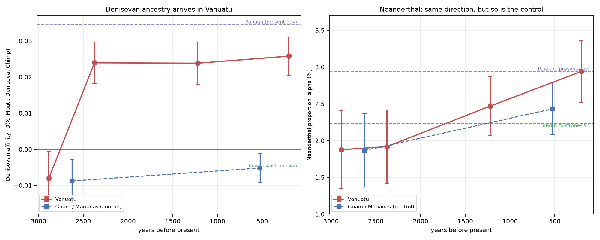
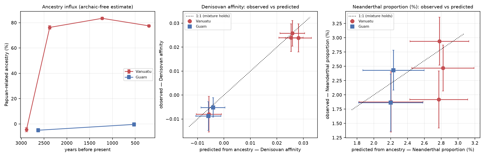
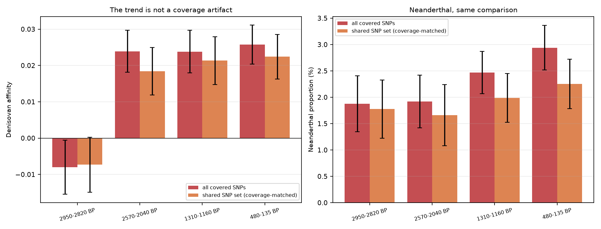
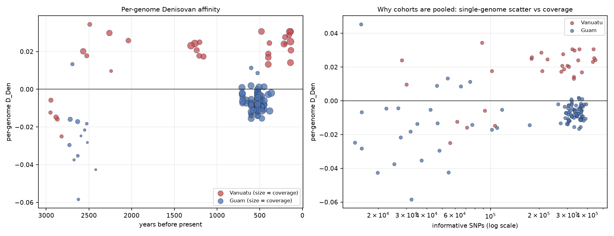

# Watching Denisovan ancestry arrive: a 3,000-year archaic-ancestry transect of Remote Oceania

*AADR v66.p1 1240k panel. 127 ancient Oceanian genomes; pooled cohort statistics with 50-block jackknife standard errors.*

## Abstract

Denisovan ancestry is normally measured on present-day genomes, so its arrival in any population is inferred from endpoints rather than observed. Remote Oceania is the exception: Vanuatu was settled ~3,000 years ago by Lapita people of overwhelmingly East-Asian/Austronesian ancestry, and Papuan-related ancestry — which carries essentially all of the region's Denisovan ancestry — arrived afterwards. Pooling 31 Vanuatu ancients into four dated horizons, Denisovan affinity rises from **-0.0080 ± 0.0074** in the founding Lapita horizon (2950-2820) — statistically indistinguishable from the Denisovan-free Taiwan-Austronesian anchor (-0.0040) — to **+0.0258 ± 0.0054** by 480-135, 4.8 standard errors from zero and 75% of the present-day Papuan value (endpoint contrast +0.0338 ± 0.0092, Z = 3.68). Contemporaneous Guam/Marianas genomes, from the same Austronesian expansion but without the Papuan influx, stay flat and Denisovan-free across the identical period (-0.0087 to -0.0052), putting the Vanuatu-minus-Guam difference-in-differences at +0.0302 ± 0.0117 (Z = 2.58). Neanderthal ancestry drifts upward in Vanuatu too (1.88% to 2.94%), but by a similar amount in the control, so its difference-in-differences is consistent with zero (Z = 0.54) and the Neanderthal change is *not* attributed to the influx; the two source populations differ by only ~0.7 percentage points in Neanderthal ancestry, making that arm intrinsically ~5x less sensitive to the same event. Papuan-related ancestry, estimated by an f4-ratio containing no archaic genome, rises from -4.5% to 77.5% across the same horizons and quantitatively predicts both archaic statistics in 12/12 cohort-statistic pairs. The transect is a direct observation of archaic ancestry entering a human population.

## Why this population

Three facts make Remote Oceania the right place to watch archaic ancestry move:

1. **A known, dated demographic event.** The first settlers of Vanuatu (Teouma, ~3,000 BP) carried little Near-Oceanian ancestry; Papuan-related ancestry largely replaced the Austronesian founding profile over the following ~2,000 years (Lipson et al. 2018; Posth et al. 2018). The demography is independently established, so archaic ancestry can be tested against it rather than fitted to it.

2. **A large archaic contrast between the two source populations.** Present-day Papuans carry the highest Denisovan ancestry of any population (pooled D_Den = +0.0345 here), while Taiwan-Austronesian groups are effectively Denisovan-free (-0.0040). A shift in mixture therefore has a large, predictable archaic signature.

3. **A control population that shares everything except the influx.** The Mariana Islands were settled from the same broad Austronesian expansion but did not receive the Papuan-related influx, and AADR covers them across the same time range.

## Cohorts and pooled statistics

Individual ancient genomes from a single horizon are often too low-coverage to resolve a percentage; the horizon as a whole is not. Each dated bin is therefore pooled into one allele-frequency vector and run through the same f-statistics the rest of the pipeline uses.

| label                | series             |   n_ind |   date_bp |   median_coverage |   alpha (%) |   alpha SE (%) |   D_Den |   D_Den_se |   D_Den_z |   D_Den_nsnp |   Papuan-related (%) |
|:---------------------|:-------------------|--------:|----------:|------------------:|------------:|---------------:|--------:|-----------:|----------:|-------------:|---------------------:|
| Papuan               | present-day anchor |      32 |         0 |            nan    |        2.94 |           0.44 |  0.0345 |     0.0058 |      5.92 |       560995 |                nan   |
| Nasioi               | present-day anchor |      13 |         0 |            nan    |        2.86 |           0.39 |  0.0246 |     0.0048 |      5.09 |       560979 |                nan   |
| Australian           | present-day anchor |       2 |         0 |            nan    |        2.87 |           0.48 |  0.0336 |     0.0059 |      5.67 |       554579 |                nan   |
| Taiwan_Austronesian  | present-day anchor |       3 |         0 |            nan    |        2.23 |           0.36 | -0.004  |     0.0045 |     -0.89 |       554756 |                nan   |
| Han                  | present-day anchor |      46 |         0 |            nan    |        2.29 |           0.38 | -0.0034 |     0.0044 |     -0.77 |       560996 |                nan   |
| Vanuatu 2950-2820 BP | Vanuatu            |       5 |      2885 |              0.25 |        1.88 |           0.53 | -0.008  |     0.0074 |     -1.07 |       266484 |                 -4.5 |
| Vanuatu 2570-2040 BP | Vanuatu            |       6 |      2375 |              0.46 |        1.92 |           0.5  |  0.0239 |     0.0058 |      4.16 |       479906 |                 76.3 |
| Vanuatu 1310-1160 BP | Vanuatu            |       6 |      1224 |              1.25 |        2.47 |           0.4  |  0.0238 |     0.0059 |      4.06 |       547659 |                 83.4 |
| Vanuatu 480-135 BP   | Vanuatu            |      14 |       202 |              2.59 |        2.94 |           0.42 |  0.0258 |     0.0054 |      4.79 |       553435 |                 77.5 |
| Guam 2700-2600 BP    | Guam               |      18 |      2626 |              0.08 |        1.87 |           0.5  | -0.0087 |     0.006  |     -1.46 |       356071 |                 -4.9 |
| Guam 600-500 BP      | Guam               |      78 |       525 |              4.11 |        2.43 |           0.35 | -0.0052 |     0.004  |     -1.28 |       557555 |                 -0.4 |




**Figure 1.** Denisovan affinity (left) and Neanderthal proportion (right) through time. Vanuatu in red, the Guam/Marianas control in blue; dashed lines are the present-day Papuan and Taiwan-Austronesian anchors. Error bars are block-jackknife standard errors.

## The influx predicts the archaic ancestry

Papuan-related ancestry is measured per cohort as `f4(Australian, Mbuti; COHORT, Taiwan_Austronesian) / f4(Australian, Mbuti; Papuan, Taiwan_Austronesian)`. **No archaic genome enters this statistic**, which is what makes the coupling a test rather than an identity. Feeding that fraction into a two-way mixture of the present-day Papuan and Taiwan-Austronesian anchors gives a prediction for each archaic statistic:

| cohort               | statistic   |   Papuan-related (%) |   observed |   predicted |   residual_z |
|:---------------------|:------------|---------------------:|-----------:|------------:|-------------:|
| Vanuatu 2950-2820 BP | alpha       |                 -4.5 |     1.8778 |      2.2032 |        -0.5  |
| Vanuatu 2950-2820 BP | D_Den       |                 -4.5 |    -0.008  |     -0.0057 |        -0.26 |
| Vanuatu 2570-2040 BP | alpha       |                 76.3 |     1.9197 |      2.7699 |        -1.4  |
| Vanuatu 2570-2040 BP | D_Den       |                 76.3 |     0.0239 |      0.0254 |        -0.19 |
| Vanuatu 1310-1160 BP | alpha       |                 83.4 |     2.47   |      2.8201 |        -0.64 |
| Vanuatu 1310-1160 BP | D_Den       |                 83.4 |     0.0238 |      0.0281 |        -0.56 |
| Vanuatu 480-135 BP   | alpha       |                 77.5 |     2.9408 |      2.7787 |         0.3  |
| Vanuatu 480-135 BP   | D_Den       |                 77.5 |     0.0258 |      0.0258 |        -0.01 |
| Guam 2700-2600 BP    | alpha       |                 -4.9 |     1.8663 |      2.2001 |        -0.53 |
| Guam 2700-2600 BP    | D_Den       |                 -4.9 |    -0.0087 |     -0.0059 |        -0.37 |
| Guam 600-500 BP      | alpha       |                 -0.4 |     2.4328 |      2.2322 |         0.4  |
| Guam 600-500 BP      | D_Den       |                 -0.4 |    -0.0052 |     -0.0041 |        -0.17 |


12 of 12 cohort-statistic pairs fall within two combined standard errors of the mixture prediction.




**Figure 2.** Left: the ancestry influx itself. Centre and right: observed archaic statistics against the values predicted from ancestry alone, with the 1:1 line.

## Controls

### The Marianas control

The primary test is the contrast between each series' oldest and youngest horizon, which is defined for a two-horizon control where a fitted slope is not. Vanuatu's Denisovan affinity rises by **+0.0338 ± 0.0092 (Z = +3.68)**. Guam, over the same period and the same coverage range, moves by +0.0036 ± 0.0072 (Z = +0.50) — no arrival. Across Vanuatu's four horizons the inverse-variance weighted trend is -0.00750 per kyr (Z = -2.58); a slope is not computed for Guam, which has only two horizons. Guam is also the empirical calibrator for coverage-linked bias: it spans the same coverage range (0.08x to 4.11x) with no true Denisovan ancestry, so any drift it shows is measurement, not biology — and it shows none resolvable.

### Difference-in-differences: the statistic that isolates the influx

Contrasting each series against itself still leaves anything that moves both series — coverage, ascertainment, batch effects — inside the estimate. Subtracting the control's change from Vanuatu's removes it. Denisovan affinity rises in Vanuatu **over and above Guam** by **+0.0302 ± 0.0117 (Z = +2.58)**. The Neanderthal difference-in-differences is +0.50 ± 0.91 pp (Z = +0.54) — consistent with zero.

This matters for how the Neanderthal panel of Figure 1 should be read. Neanderthal ancestry rises by a similar amount in Guam (1.87% to 2.43%) as in Vanuatu (1.88% to 2.94%), and Guam had no Papuan influx at all. The parsimonious reading is therefore that the apparent Neanderthal rise is **shared measurement drift, not the demographic event** — both series gain coverage over the same interval. Only the Denisovan signal is specific to the population that actually received the influx, which is precisely what makes the control worth having.

### Coverage matching

The oldest Vanuatu horizon is also the lowest-coverage one (median 0.25x versus 2.59x), so every cohort statistic was recomputed on the 495,760 SNPs covered in **all** Vanuatu bins. The rise survives: contrast +0.0297 ± 0.0097 (Z = +3.05), weighted trend -0.00786/kyr (Z = -2.46).

| label                |   date_bp |   alpha (%) |   D_Den |   D_Den_se |   D_Den_z |   D_Den_nsnp |
|:---------------------|----------:|------------:|--------:|-----------:|----------:|-------------:|
| Vanuatu 2950-2820 BP |      2885 |        1.78 | -0.0073 |     0.0076 |     -0.97 |       255053 |
| Vanuatu 2570-2040 BP |      2375 |        1.66 |  0.0184 |     0.0066 |      2.81 |       255053 |
| Vanuatu 1310-1160 BP |      1224 |        1.99 |  0.0214 |     0.0066 |      3.24 |       255053 |
| Vanuatu 480-135 BP   |       202 |        2.25 |  0.0224 |     0.0061 |      3.65 |       255053 |




**Figure 4.** Each cohort computed on all covered SNPs (red) and on the SNP set shared by every Vanuatu horizon (orange).

### Why the Neanderthal arm is weaker, and what it can say

The Neanderthal contrast across the transect is +1.06 ± 0.68 percentage points (Z = +1.57) — the right sign, not individually significant. This is expected rather than disappointing. The mixture model predicts a Neanderthal change of only +0.54 pp across the whole influx, because Papuans (2.94%) and Taiwan Austronesians (2.23%) differ so little in Neanderthal ancestry, while this data resolves a contrast to ± 0.68 pp. The test is therefore underpowered *by construction*: the observed value is consistent with the predicted one, and would also be consistent with no change. It is reported as corroborating direction, not as independent evidence. The Denisovan arm carries the result because the same demographic event produces a 5x larger contrast there.

### Damage sensitivity (transversions only)

Deamination damage is highest in the oldest libraries — the same horizon carrying the 'no Denisovan yet' claim — so the whole analysis was repeated on transversions only, which are immune to that error class. The Denisovan contrast is essentially unchanged in **effect size** (+0.0319 versus +0.0338 on the full panel) but its standard error roughly doubles (0.0170 versus 0.0092) because ~80% of SNPs are discarded, so Z falls to +1.88. That is a loss of power, not a contradiction. The ancestry estimate — the demographic backbone of the result — replicates almost exactly (-1.9% to 79.8% Papuan-related). Absolute values are not comparable between the two SNP sets, since the transversion subset is differently ascertained; only the within-run pattern is. Full numbers in `oceania_cohorts_transversions.csv`.

### Effect sizes, not Z scores

Low coverage inflates a standard error without moving the point estimate, so comparing horizons by Z would manufacture a trend wherever coverage trends. Every comparison above is on effect sizes; Z is reported only as significance against zero.




**Figure 3.** The per-genome view, and the reason cohorts are pooled: single-genome D_Den scatter collapses as informative-SNP count rises. Unlike every other figure here, this panel shows the Phase-3 per-genome estimates, which are always computed on the full panel — it is therefore identical in the transversions-only run.

## Limitations

- **D_Den is a relative affinity, not a percentage.** The pipeline does not calibrate an absolute Denisovan fraction, so the result is stated as a rise from ~0 to 75% of the present-day Papuan level, not in percent Denisovan.

- **Cohort sizes are small** (5-15 genomes per Vanuatu horizon). Pooling makes each horizon well powered for the pooled statistic, but the horizons are not independent random samples of their populations, and Teouma in particular is a single cemetery.

- **The ancestry fraction assumes a two-way mixture** of a Papuan-related and a Taiwan-Austronesian-related source, with Australians standing in as the Sahul-related reference. Real Remote Oceanian history involves multiple Near-Oceanian sources; a Han-based sensitivity is reported in `oceania_cohorts.csv` (`f_papuan_hanbase`).

- **Present-day Papuan and Taiwan-Austronesian anchors** are used as mixture endpoints, which assumes their archaic levels stand for those of the actual ancient sources.

- Australians and Papuans share Denisovan ancestry as part of their shared Sahul history, so the ancestry-fraction statistic is free of archaic *genomes* but not of archaic *ancestry* in its reference populations. It measures Papuan-related ancestry, which is the intended estimand.

## Reproduce

```bash
python scripts/oceania_transect.py --panel 1240k
python scripts/oceania_transect.py --panel 1240k --transversions
```


*Refs: Reich et al. 2011 AJHG 89:516; Meyer et al. 2012 Science 338:222; Skoglund et al. 2016 Nature 538:510; Lipson et al. 2018 Curr. Biol. 28:1157; Posth et al. 2018 Nat. Ecol. Evol. 2:731; Patterson et al. 2012 Genetics 192:1065; Mallick et al. 2024 Sci. Data 11:182 (AADR).*
